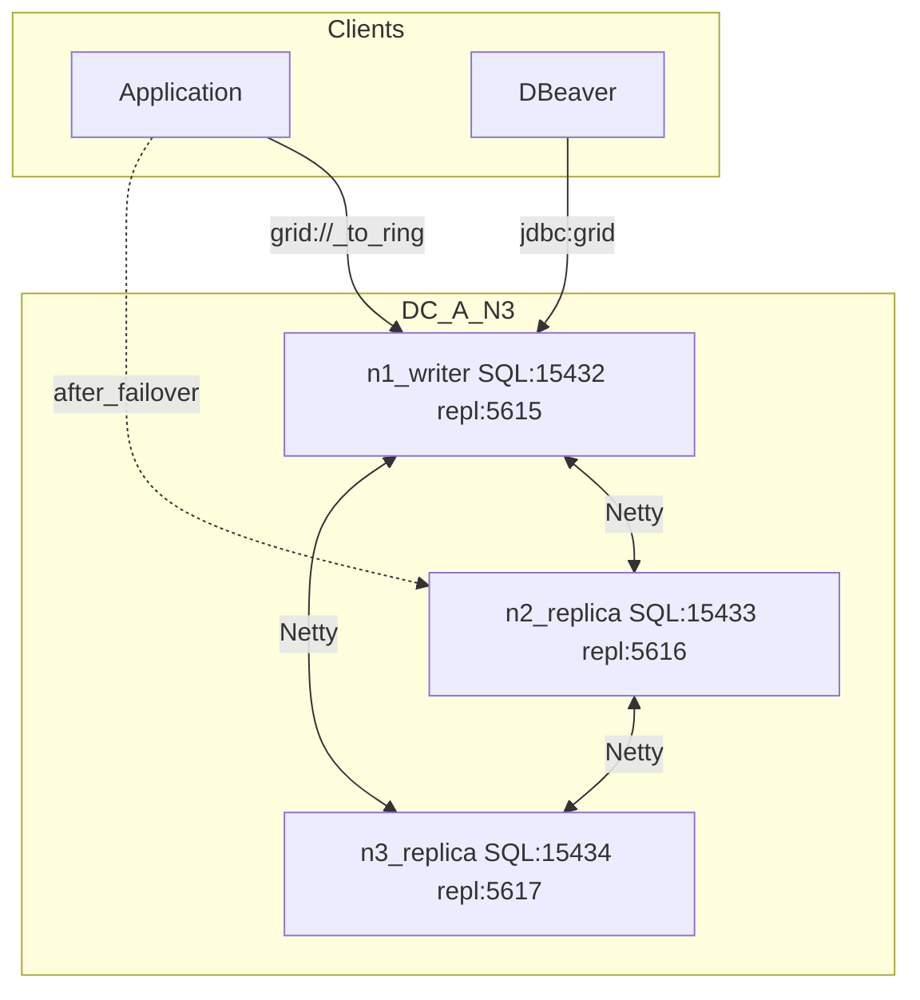
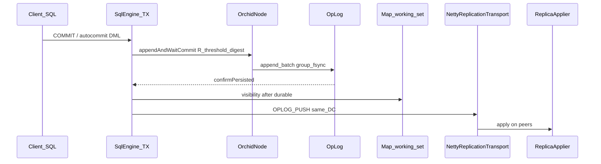
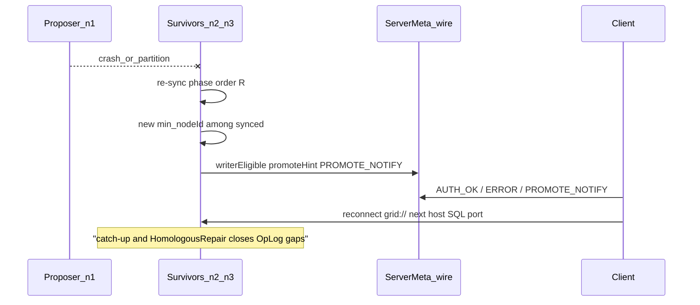

# Cluster HA (1-DC) + high-load

High availability inside one data center uses ORCHID (phase sync after Kuramoto plus digest quorum). Clients speak **SQL TCP**; peers speak **replication Netty** on a different port.

## Ports (do not mix)

| Port (default) | Protocol | Used by |
|----------------|----------|---------|
| **15432** | SQL LE frames (`grid://` / `jdbc:grid://`) | Apps, DBeaver, Jepsen client |
| **5615** (+1 per peer) | Replication Netty (`OPLOG_PUSH`, ORCHID, repair) | Nodes only |

Pointing a SQL client at `5615` fails frame decode. See [replication-network.md](../../understand/replication-network.md).

**Notes:** `jdbc:grid://` is the JDBC client in `grid-sql-client` (apps and DBeaver). The reactive path is `ConnectionFactory` + `grid://`. Query MapReduce resolves keys locally by default. SIMD benches need `--add-modules=jdk.incubator.vector`.

## Topologies in one DC

Quick 1+1 pair: [start a cluster](../../getting-started/start-cluster.md). Below is the three-node ring.

### Topology N=3



- **Writer node:** `min(nodeId)` among synced peers (`phaseRankedProposer`; `writerEligible` flag).
- **Replicas:** async same-DC OpLog ship; short lag is expected ([promote a node](ha-promote.md)).
- Per-node `dataDir` (no shared NFS/SAN across the cluster).

## Write path



Detail: [architecture](../../understand/architecture-overview.md), [replication-network.md](../../understand/replication-network.md), [storage](../../understand/storage-sealed-gmap.md).

## Failover (promoteHint)



No Raft election / term / vote. Ops story: [ha-promote.md](ha-promote.md).

### Client URL (multi-host) — 1-DC

Reference pattern: every SQL port in the write ring, comma-separated; pin on live TCP, next endpoint on connect/channel death:

```
grid://u:p@n1:15432,n2:15433,n3:15434/public?connectTimeoutMs=1000&retryMode=FIXED&maxRetries=2
```

Host-published (Docker / local compose):

```
grid://u:p@127.0.0.1:15432,127.0.0.1:15433,127.0.0.1:15434/public?connectTimeoutMs=1000&retryMode=FIXED&maxRetries=2
```

| Knob | Why |
|------|-----|
| All ring peers in authority | After proposer crash, TCP failover reaches survivors |
| `connectTimeoutMs` | Fail fast on a dead endpoint |
| `retryMode` + `maxRetries` | Retry connect across the endpoint list |
| `maxTxContexts` | Soft session cap on one TCP (not N sockets) |

**Prod pattern:** pin from wire `ServerMeta` (`AUTH_OK` / `ERROR` / `PROMOTE_NOTIFY`) on `writerEligible` (and `regionEpoch` when region fencing is on). On orchid/stale/region fence mid-op do **not** silent-rotate the pin; call `rediscoverWriter()`. Full runbook: [ha-promote.md](ha-promote.md).

## Kubernetes / Actuator probes

Enable probes (`management.endpoint.health.probes.enabled: true`) and expose `health,prometheus`. Include `gridReadiness` in the readiness group (see `grid-sql-server-starter` `application.yml`).

| Path (starter `base-path: /`) | Role |
|------|------|
| `/health/liveness` | Process alive (`livenessState`) |
| `/health/readiness` | Traffic-ready: `gridReadiness` — SQL TCP listening (when enabled) and solo durable **or** ORCHID synced |
| `/prometheus` | Micrometer / Prometheus scrape |

If Actuator keeps the default Spring base path, the same groups are under `/actuator/health/*` and `/actuator/prometheus`.
## YAML recipe -- prod high-load (1-DC)

Tune for write throughput + durable group fsync. Values are a starting point; validate with Jepsen + QG on your hardware.

```yaml
grid:
  durability:
    enabled: true
    hydrate-mode: LAZY
    working-set-max-entries: 2_000_000
  sql:
    default-shards: 16
  sql-server:
    enabled: true
    host: 0.0.0.0
    port: 15432
  replication:
    enabled: true
    node-id: n1
    cluster-id: prod-dc-a
    orchid:
      coupling: 15.0
      natural-freq-hz: 1.0
      order-threshold: 0.85
      tick-ms: 10
      digest-quorum: MAJORITY
    repair:
      homologous-enabled: true
      reconcile-interval-ms: 5000
    swarm:
      enabled: true
      score-window-ms: 5000
      migrate-threshold: 0.3
    placement-optimizer:
      enabled: true
    transport:
      bind-host: 0.0.0.0
      bind-port: 5615
      peers:
        - { id: n2, host: n2.internal, port: 5615, dc: dc-a }
        - { id: n3, host: n3.internal, port: 5615, dc: dc-a }
    cross-dc:
      enabled: false
    op-log:
      data-dir: ./data/n1/replication
      fsync: true
    flow:
      max-inflight-ops: 20000
```

**Knobs that matter under load**

| Knob | Role |
|------|------|
| `op-log.fsync` | Durability; batch path amortizes group fsync |
| `orchid.tick-ms` / `order-threshold` | Sync admission; keep `2*pi*freq*tick/1000 << 1` |
| `sql.default-shards` | Shard parallelism on CREATE TABLE |
| Concurrent TX on one TCP | Hard channel cap is **8**; Boot does not apply `grid.sql.max-tx-contexts` to the listener — open more `Connection`s ([SQL server](../configuration/sql-server.md)) |
| `durability.working-set-max-entries` + `hydrate-mode` | RAM ceiling vs sealed miss cost |
| `swarm` / `placement-optimizer` | Load hints; production `apply-auto-cutover` default **true** (see [bio-inspired.md](../../understand/bio-inspired.md); set `false` only to suppress migrate under load) |

## Validation

| Contour | Where |
|---------|--------|
| External Jepsen N=3 | [benchmarks/jepsen/README.md](../../../../benchmarks/jepsen/README.md) |
| Chaos ITs | `index.unit.replication.chaos.**` |
| Promote / RPO | [ha-promote.md](ha-promote.md) |
| Wire / Cross-DC modes | [replication-network.md](../../understand/replication-network.md) |

Multi-DC topologies: [cluster-multidc-highload.md](cluster-multidc-highload.md).

### Replica read channels (off by default)

Full methodology: [replica-reads.md](replica-reads.md).

Writes and open TX stay on the pinned proposer URL. Autocommit reads use replica channels:

```
grid://u:p@n1:15432,n2:15433/public?readEndpoints=n2:15433&readPreference=REPLICA&maxReadConnections=2
```

- Server: `grid.replication.ha.replicaReadsEnabled=true` (starter primary/replica profiles enable it for demos).
- Stale policy v1: **FAIL_CLOSED**.
- App: `ConnectionFactory.fromUrl` (auto-route when `readEndpoints`) → optional `createReadStatement` / `executeRead`.

Incidents: [failures](failures.md).