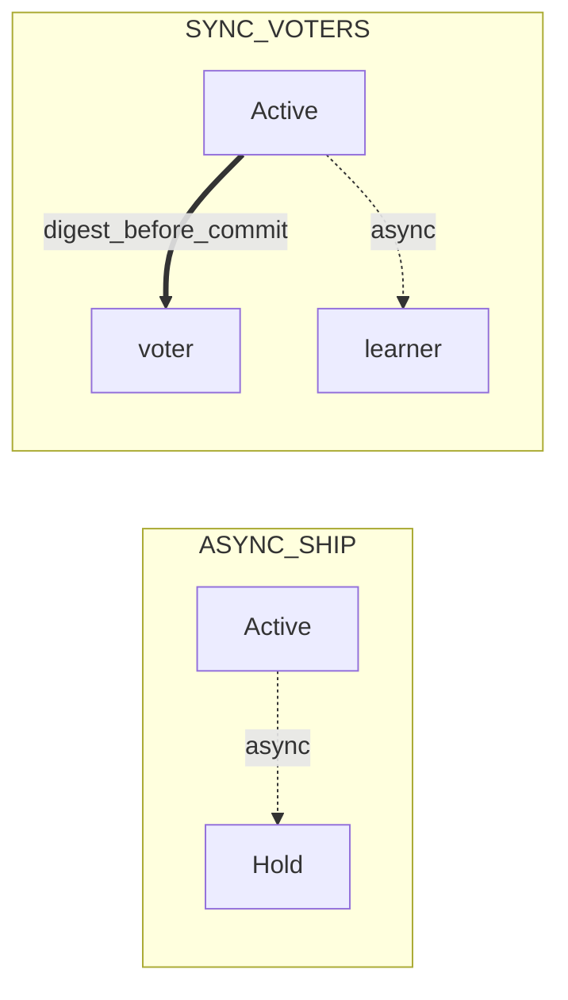

# Multi-site

Short operator page: site roles, which replication mode to pick, and how to connect the client. Topologies, YAML recipes, and measurements live in [multi-site under load](cluster-multidc-highload.md).

## Site roles

Exactly one site accepts writes at a time. The role is set on the node with `grid.replication.region.role`.

| Role | Accepts writes | Purpose |
|------|----------------|---------|
| `ACTIVE` | Yes, if the node also passes ORCHID admission | Current write ring; owns `regionEpoch` |
| `HOLD` | No, but may claim the role | Backup site: catches up on the journal, ready to become Active |
| `WITNESS` | No | Arbiter: votes only on role transfer |

### Role → writes / reads

| Role | DML/TX writes | SELECT (when policy allows) |
|------|---------------|------------------------------|
| Active (+ ORCHID admission) | Yes | Yes |
| Hold | No | Yes under controlled lag; otherwise reject |
| Witness | No | No |

Role transfer happens when Active stays silent longer than `claim-timeout-ms` and Hold gathers a confirmation quorum (`quorum-size`). Then `regionEpoch` increments by one. A revived former Active site does not become Active again on its own — it moves to Hold.

Site fencing is enabled with `grid.replication.region.enabled`. By default it is off, and the older fixed primary-site scheme applies.

## Cross-site replication modes

Mode is set in `grid.replication.cross-dc.mode`.

| Mode | What happens | Cost |
|------|--------------|------|
| `ASYNC_SHIP` | Transaction commits locally; the journal ships to the backup site asynchronously | Backup lag: some recent writes may not arrive |
| `SYNC_VOTERS_ACROSS_DC` | Commit waits for remote voter ACKs (cap: `remote-ack-timeout-ms`) | Every write pays a WAN round trip |

Full node maps and measurements: [multi-site under load](cluster-multidc-highload.md).

The choice is write latency versus how much you may lose if a whole site dies.

### Which mode when

| Need | Mode |
|------|------|
| Lowest write latency; Hold RPO is acceptable | `ASYNC_SHIP` |
| Keep recent commits if the Active site dies (cost: WAN on every commit) | `SYNC_VOTERS_ACROSS_DC` |
| Reads from Hold with controlled lag | Either mode + a separate read URL; see [replica reads](replica-reads.md) |

### Voters and learners (`cross-dc`)

| Key | Meaning |
|-----|---------|
| `cross-dc.voters` | Remote nodes that ack digest under `SYNC_VOTERS_ACROSS_DC`. Empty list → all remotes except `learners` |
| `cross-dc.learners` | Async journal only; not in the sync quorum |
| `cross-dc.phase-coupling` | Default **off** — do not fold remote phases into local `R` |

YAML and load: [multi-DC under load](cluster-multidc-highload.md).

## What breaks under fencing

| Symptom | What to do |
|---------|------------|
| Write rejected for `regionEpoch` | Do not rotate to the next URL host — call `rediscoverWriter()` ([promote](ha-promote.md)) |
| Two clients writing after a claim | Ensure the write URL is not treating Hold/Witness as writers; one claim winner |
| Readiness DOWN on the new Active | Wait for ORCHID sync; check `orchid_r` / `writerEligible` in [monitoring](../monitoring.md) |

## Client connection

The client sticks to a node with `writerEligible` and a matching `regionEpoch`. Hosts in the URL are reconnect candidates, not a round-robin of writers. After Active changes, call `rediscoverWriter()` — do not rotate the next URL host by hand.

| Configuration | What to put in the URL |
|---------------|------------------------|
| Fencing off | Only Active-site node addresses |
| Fencing on | Both sites may be listed; the client still pins on `writerEligible` with a matching `regionEpoch` |
| Reads from Hold | A separate URL that points only at Hold nodes |

A Hold or Witness node accepts TCP but rejects writes. Reads from Hold are allowed if the application accepts a reject on high lag — stale data is never returned instead of an error. Witness serves neither writes nor reads.

If a node rejects an operation because `regionEpoch` does not match, the client must not silently rotate to the next address — that risks two writers. Correct behaviour is `rediscoverWriter()`; details in [promote a node](ha-promote.md).

## Active-site loss

When Active stays silent longer than `claim-timeout-ms`, Hold gathers a confirmation quorum (`quorum-size`), `regionEpoch` increments by one, and the new Active accepts writes. The client must **not** rotate to the next host in the URL: call `rediscoverWriter()` and pin on a node with `writerEligible` and the new epoch. Full YAML and load recipes: [multi-DC under load](cluster-multidc-highload.md).

**ASYNC_SHIP.** Commit stays local; the journal ships to Hold asynchronously. Losing Active can drop fresh commits within the lag window (RPO on Hold) — that is the price of low write latency.

**SYNC_VOTERS_ACROSS_DC.** Commit waits for a remote digest. After Active loss, commits that already passed quorum are on Hold — the price is WAN RTT on every commit.

### Drill cadence (Active loss / failback)

On a lab or secondary stand (not during peak write on the only live Active), periodically:

1. Confirm one Active and a known `regionEpoch` before the drill.
2. Simulate Active silence past `claim-timeout-ms` (or stop Active nodes cleanly on the stand).
3. Verify Hold claim: new Active, `regionEpoch` +1, readiness UP, `writerEligible` on the winner.
4. Client path: `rediscoverWriter()` — not the next URL host; smoke write succeeds only on the new Active.
5. Failback: restore the former Active as Hold (or per your topology), wait for catch-up, record RPO window for `ASYNC_SHIP` vs near-zero digest lag for `SYNC_VOTERS`.

**RPO check.** For `ASYNC_SHIP`, measure Hold lag (`rpoEstimateMs` / apply lag) before declaring the drill done. For `SYNC_VOTERS`, confirm remote voters were in the quorum path. Full load recipes: [multi-DC under load](cluster-multidc-highload.md).

## Labs

Ready compose topologies `multidc-async` and `multidc-sync` are in [Compose deploy](deploy-compose.md). Both use the same ports, so bring up one at a time.

Incident playbook: [failures](failures.md). Current planning numbers: [capacity](../../performance/capacity-slo.md).

**Related:** [promote a node](ha-promote.md), [failures](failures.md), [replication config](../configuration/replication.md), [replication network](../../understand/replication-network.md), [monitoring](../monitoring.md).
