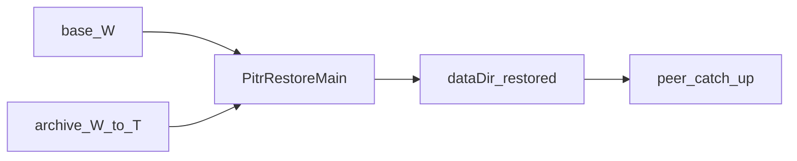

# Point-in-time recovery (PITR)

Restore a node to logical ORCHID seq `T` from a sealed **base** and an OpLog archive.

PITR is about durability and rollback, not TPS. Do not weaken ORCHID, fsync, or living planning numbers for a “faster” backup.

## Schedule before an incident

| Step | When | Action |
|------|------|--------|
| Enable archive | Before the first load you may want to roll back | `oplog-archive.enabled: true`, own `dir` per node |
| Base backup | On schedule (daily / before release) | Capture sealed + orchid state at watermark `W` (`SealedBaseBackupUtil`) |
| Coverage check | After truncate / regularly | Archive covers the tail after `W`; otherwise restore to `T > W` will stop short |
| Practice restore | On a copy of `dataDir`, not the live writer | Run `PitrRestoreMain --until-seq` offline |

If archive was off at failure time, there is nothing to restore.

**Practice restore cadence.** After archive and the first base backup are in place, periodically restore onto a **copy** of `dataDir` (never the live writer): confirm coverage past watermark `W`, then `PitrRestoreMain --until-seq`. Treat a failed drill as an ops defect before the next real incident.

## Short incident procedure

1. **Incident.** Stop the node; do not write the damaged `dataDir`.
2. **Offline restore.** Empty `dataDir` → install base → `PitrRestoreMain --until-seq T` → replay archive `[W+1 … T]`.
3. **Rejoin.** Start the node; catch up replicas. On Multi-DC respect `regionEpoch`.



## Model

1. **Base** — sealed `.gmap` / `.sbpt` / `.sbm` plus orchid `state.bin`, locus, and `index-ckpt` at watermark `W ≤ T`.
2. **Archive** — OpLog segments `[W+1 … T]` outside the live `dataDir` (per-node disk; not shared NFS/SAN).
3. **Restore (offline)** — empty `dataDir` → base → replay until `--until-seq T` → `discardOpenTxStaging`.
4. **Cluster** — one node, then peer catch-up (SparseCatchUp / HomologousRepair).

Seq defines order. Wall-clock → seq mapping is separate ops metadata.

## What is not restored

| State | After restore |
|-------|----------------|
| Open (dirty) transactions before COMMIT | No — they were never in OpLog |
| RAM working set | Rebuilt (LAZY/FULL hydrate) |
| Foreign `cluster-id` / foreign epoch | The node will not “replace” peers by itself — fix configuration |

## Settings

```yaml
grid:
  durability:
    oplog-archive:
      enabled: false
      dir: ./data/oplog-archive
      stream-enabled: false
      stream-dir: ""            # blank → {dir}/stream when stream-enabled
```

| Parameter | Effect |
|-----------|--------|
| `oplog-archive.enabled` | Before truncate, copy the range into the archive; I/O error **cancels** truncate |
| `oplog-archive.dir` | Archive root (segment-replace layout) |
| `oplog-archive.stream-enabled` | Stream archive to another node on safe truncate after catch-up |
| `oplog-archive.stream-dir` | Stream root; blank → `{dir}/stream` |

Archive I/O is synchronous on the calling thread; not on the Netty EL.

## Tools

| Class | Package | Role |
|-------|---------|------|
| `OpLogArchiveUtil` | `org.genfork.grid.replication.util` | Archive / archive-before-truncate |
| `OpLogArchiveStreamer` | `org.genfork.grid.replication.util` | OpLog stream append-only beyond the node |
| `SealedBaseBackupUtil` | `org.genfork.grid.replication.snapshot` | Base backup / install `dataDir` |
| `PitrRestoreMain` | `org.genfork.grid.replication.pitr` | CLI restore to seq |
| `PitrCoordinatedRestore` | `org.genfork.grid.replication.pitr` | Cross-site restore under Active fencing |
| `PitrActiveFence` | `org.genfork.grid.replication.pitr` | Fail closed: Active / dual-writer |

```text
java --enable-preview -cp ... org.genfork.grid.replication.pitr.PitrRestoreMain \
  --base ./backup/base-W \
  --archive ./data/oplog-archive \
  --data-dir ./data/replication/cluster/node-restored \
  --until-seq 125000 \
  --domain my.Table \
  --shard 0
```

Coordinated cross-site restore: `PitrCoordinatedRestore.restoreUnderActiveFence(ACTIVE, remoteAlsoActive=false, …)` — rejects if the site is not Active or a remote peer is also Active.

## Do not

- Enable `oplog-archive` only at failure time — there will be no archive.
- Write the damaged `dataDir` “just in case” — you smear the hole.
- Put restore on shared NFS/SAN for the whole cluster — directory is per node.
- Restore every site at once without Active fencing — dual-writer risk.

## Restore failure symptoms

| Symptom | Likely cause |
|---------|--------------|
| Replay stops / empty range | Archive does not cover `[W+1 … T]` or archive was off |
| Seq mismatch vs expectation | Wrong `--until-seq` or base from another watermark |
| Node does not catch up peers | Foreign `cluster-id` / epoch; shared dataDir; see HomologousRepair |
| After restore “open TX gone” | Expected: dirty before COMMIT is not in OpLog |
| Restore rejected (Active fence) | Site is Hold/Witness or dual-writer / two Actives |

**Related:** [durability](../configuration/durability.md), [GMAP storage](../../understand/storage-sealed-gmap.md), [failures](failures.md), [upgrade](upgrade.md).