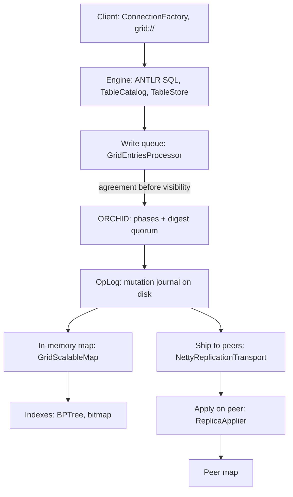

# Architecture overview

Grid is a distributed SQL database: the schema is ordinary SQL DDL, hot rows live in memory as binary blobs, and — when durability is enabled — every change reaches the mutation journal (OpLog) and the sealed map files before any reader can see it. Writes between nodes are agreed by the ORCHID protocol.

The layers below are the map of the system: who owns which decision, what is a contract and what is an implementation detail, and where the details live.

## The path of one request

*Figure 1. A write passes agreement and the journal before any reader can see it.*

The key property of this ordering: **on failure we do not proceed**. If ORCHID did not admit the write or the OpLog did not confirm persistence, the row never appears in the map — instead of a partially applied commit the client gets a rejection. There is no intermediate "visible in memory, not yet on disk" state to reason about, and no background task that could later make a rejected write appear.

## Layers

| Layer | Role | More |
|-------|------|------|
| Client | `grid-sql-client`: reactive (`grid://`, `ConnectionFactory` / `TxContext`) or JDBC (`jdbc:grid://`) | [Java client](../develop/java-client.md), [JDBC client](../develop/jdbc-tooling.md) |
| Engine | SQL parsing through ANTLR, the table catalog, SELECT planning, transaction commit | [SQL fundamentals](../sql/fundamentals.md), [support matrix](../sql/support-matrix.md) |
| Write | The asynchronous `GridEntriesProcessor` queue, then agreement and the journal | [the write path](write-path-staging.md) |
| Storage | In memory, `GridScalableMap` holds the working set; on disk there are sealed `.gmap` files, `.sbpt` / `.sbm` indexes and the OpLog | [storage](storage-sealed-gmap.md) |
| Agreement | ORCHID: phase synchronization (after Yoshiki Kuramoto) and digest quorum. There are no terms and no leader elections as in Raft | [ORCHID](orchid-consensus.md) |
| Replication | Between nodes it is always Netty. Between data centres there are `ASYNC_SHIP` and `SYNC_VOTERS_ACROSS_DC` modes | [replication network](replication-network.md), [replication state](replication-state.md) |
| Placement | `AdaptiveReplicaSwarm` can move shard ownership; `PIN` temporarily forbids moves for selected keys | [shard placement](overlay-and-swarm.md) |

The old "WAL on top of the map" path and the double-write of compact snapshots have been removed. With durability enabled, the source of truth is the OpLog plus sealed files, and the in-memory map is an accelerator.

## Modules

| Module | Contains |
|--------|----------|
| `grid-commons` | JDK-only shared code: `SqlType`, `SqlResult`, `SqlFrame`, `ServerMeta`, encode buffers. No Reactor, no Netty |
| `grid-sql-antlr` | The `SimplifiedSql.g4` grammar, the generated parser and the client-side route classifier |
| `grid-sql-client` | The SQL SPI (`ConnectionFactory`, `TxContext`), the wire frames, the remote Netty transport, the CLI, and the JDBC client |
| `grid-server-core` | Store, indexes, `SqlEngine`, transactions, replication, the Netty SQL server, Spring Boot auto-configuration |
| `grid-sql-server-starter` | The runnable server artefact (SQL over TCP) |

A consumer application depends on the client module and speaks SQL. There are no annotated repositories and no domain entity classes to map: the schema lives in the catalog, not in application code.

## A row never becomes an object in the middle

Inside the server a row is a packed binary record with an offset table at the end. `LogicalFieldCursor` reads a field at its offset; join keys, filter keys and index keys stay as `byte[]` or as zero-copy spans over that record all the way through the pipeline. Decoding into Java objects happens only at the edges: the client result, `EXPLAIN` text, and literals coming in from the SPI.

Two practical consequences. Adding a column with `ALTER TABLE` does not rewrite stored rows — older rows simply have no value at that offset and read as `NULL`. And selecting two columns from a wide table does not deserialize the whole row.

Structural `UPDATE` follows the same rule: the server reads the current row through the cursor, rewrites the affected fields in place through `BlobFieldModifier`, and the final row bytes go to the journal as a single `UPSERT`. There is no storage-level "increment" or "append to field" operation.

## Threads

| Pool | Threads | What runs there |
|------|---------|-----------------|
| Logic | Virtual threads | SQL execution per session, record-lock waits, commit waits |
| CPU | Platform, roughly one per core | Parallel scan, map-reduce fan-out, encode-heavy work |
| I/O | Platform, bounded | Journal and sealed-file I/O, archive copies |
| Netty event loops | Platform | Frame decode and encode only |

The rule that shapes the whole server: a Netty event-loop thread never waits for SQL, for a quorum or for a lock. Inbound frames are handed to a per-session serial mailbox on a logic virtual thread, and everything that can block happens there. Virtual threads are used for *waiting* — many concurrent lock parks and commit waits cost almost nothing — while CPU fan-out goes to the bounded platform pool instead, so a heavy scan cannot starve the rest of the node.

## Node topologies

From a solo durable node to multi-site, diagrams live on the ops pages:

- Solo and 1+1 — [start a cluster](../getting-started/start-cluster.md)
- N=3 ring and failover — [HA in one DC](../configure-and-operate/operations/cluster-ha-highload.md)
- Active/Hold, ASYNC and SYNC — [multi-site](../configure-and-operate/operations/multi-dc.md)
- Client pin and Witness (quorum for role capture; does not serve app traffic) — [promote a node](../configure-and-operate/operations/ha-promote.md)

## A working set, not the whole dataset

When durability is enabled, memory is the **working set**: the hot keys that serve queries without touching disk. Everything else lives in sealed files and is loaded on a miss. The limit is set by `working-set-max-entries`: cold committed keys are evicted by LRU, while dirty keys and those still in the queue never are.

This is why an "empty" heap after a restart with `hydrate-mode: LAZY` is not data loss. Truth is on disk; the map refills as traffic arrives. Configuration: [durability](../configure-and-operate/configuration/durability.md).

## Heavy query execution

Heavy SELECTs run through adaptive execution (AQE): `QueryHeavinessEstimator` estimates cost, and `AdaptiveParallelScan` plus `AdaptiveChunkScheduler` spread the work across the CPU pool. On top of that there is MapReduce over domain shards (`ShardPartitionPlanner`, `DistributedKeyFanOut.mapReduceByShard`).

An important detail: key resolution is **local by default**. The old mode that broadcast identical SQL to peers is considered obsolete and is disabled. Fan-out spreads *shard-local* keys across threads of one node; it is not a distributed query engine.

Residual equality conditions are evaluated on packed bytes (`WireResidualBatch`), optionally with vector instructions through `ArrayVectors`. SIMD requires the JVM flag `--add-modules=jdk.incubator.vector`.

Plans and the `AQE_PARALLEL` and `DIST_MAP` nodes in EXPLAIN output: [EXPLAIN and AQE](../sql/explain-and-aqe.md).

## Two distinct write-buffering layers

They are easy to confuse, so it is worth keeping the distinction in mind:

| Layer | Where it lives | What it does |
|-------|----------------|--------------|
| Write queue | `GridEntriesProcessor` | Asynchronously flushes changes into the map. With durability enabled, `MutationRecorder` first runs the ORCHID → OpLog → confirmation chain |
| Apply-time buffering | `ReplicaApplier`, per `(domain, shard)` pair | Buffers `UPSERT` and `DELETE` between `TX_BEGIN` and `TX_COMMIT`, flushes on commit, discards on rollback |

When replication is enabled, transactions additionally write lifecycle markers (`TX_BEGIN`, `TX_COMMIT`, `TX_ABORT`) into the OpLog — through ORCHID, by the same path. Markers do not replace the rows themselves: data changes still go through the full chain. On a peer a transaction is applied in one piece, so a reader never sees a partially applied transaction.

Multi-shard transactions are assembled by `MultiShardCommitBarrier`: it waits for the streams of all touched tables and lays a single `TX_BEGIN` → operations → `TX_COMMIT` block into the OpLog. This is a local commit-flush barrier on the proposer, not distributed two-phase commit over foreign resource managers.

Step-by-step breakdown: [the write path](write-path-staging.md), [visibility and concurrency](concurrency-and-visibility.md).

## What the architecture does not have

So there are no false expectations:

- **No Raft-style leader elections.** The right to write comes from ORCHID: sufficient phase synchrony plus digest agreement.
- **No separate write-authorization service.** Frame `AUTH` opens the user catalog and GRANT path (`privileges.meta`); it is not a commit arbiter and not 2PC. ORCHID and OpLog own write admission and durability. Operators: [security](../configure-and-operate/operations/security.md).
- **No CRDT merge of multiple masters.** Peers catch up on the journal and heal by repair, not by merging competing versions.
- **No MVCC snapshot versions.** A committed row has one current value; concurrent writers are ordered by record locks, not by row versions — [visibility and concurrency](concurrency-and-visibility.md).
- **Own application frames only** on the product path: client and server exchange Grid little-endian frames.

## Capacity

Cluster throughput with durability enabled is bounded by two things: journal fsync and ORCHID admission. That is an honest ceiling, not a marketing "millions of operations per second". Idle CPU during a write-heavy run does not mean there is headroom — it usually means the run is waiting on one of those two. On the lab host, throughput starts to fall off past roughly 128 concurrent clients.

Run results and reference thresholds: [capacity and SLO](../performance/capacity-slo.md), [methodology](../performance/methodology.md).

## Common architecture misreads

| Misread | Reality |
|---------|---------|
| "Memory is source of truth" | With durability, OpLog + sealed are authoritative; RAM is the working set |
| "Replication = durability" | Separate switches: solo durable without peers is normal |
| "ORCHID = Raft leader election" | Phase + digest quorum; no Raft-style leader election |
| "PIN = row lock" | PIN is about shard migration, not SQL locking |
| "Fan-out = distributed SQL" | Fan-out parallelizes shard-local keys on one node |

## Related

- [Storage: sealed map files](storage-sealed-gmap.md)
- [The write path](write-path-staging.md)
- [ORCHID consensus](orchid-consensus.md)
- [Visibility and concurrency](concurrency-and-visibility.md)
- [Replication network](replication-network.md)
- [Shard placement](overlay-and-swarm.md)
