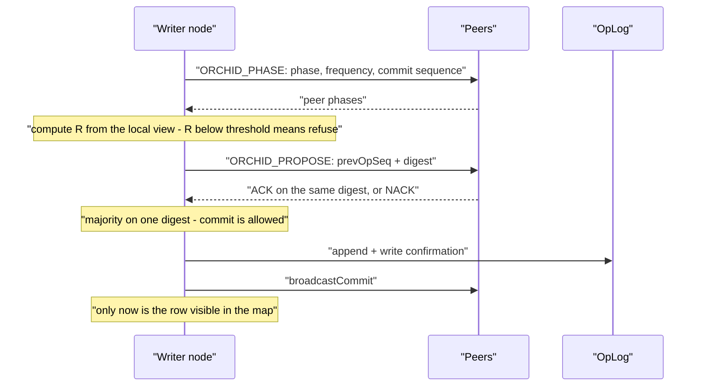

# ORCHID consensus

ORCHID answers one question: **may a write be admitted right now, and who proposes it**. The mechanism has two parts — phase synchronization between nodes (coupled oscillators after Yoshiki Kuramoto) and digest agreement on the concrete operation.

There are no terms, no leader elections and no voting API as in Raft. Recovery after a failure is re-synchronization of phases plus digest agreement, not a new election.

## Core concepts

| Concept | Meaning |
|---------|---------|
| Order parameter `R` | A numeric measure of how phase-synchronous the nodes are. Writes are admitted when `R ≥ order-threshold` |
| Proposer node | Chosen by phase: `min(nodeId)` among the synced nodes. Only it assigns the next operation sequence number |
| Digest agreement | A majority must confirm **the same** digest before a commit becomes visible |
| `OrchidNotSyncedException` | Write admission refused: either `R` is below the threshold, or there is no digest agreement |
| Solo mode | A node writes on its own, but only if the peer list was empty from the start (`N = 1`) |

Defaults: `coupling: 15.0`, `natural-freq-hz: 1.0`, `order-threshold: 0.85`, `tick-ms: 10`, `digest-quorum: MAJORITY`.

## Two questions, two mechanisms

It helps to keep the two halves apart, because they fail differently and are observed differently.

| | Phase synchronization | Digest agreement |
|--|-----------------------|------------------|
| Question answered | May this node propose writes at all? | Is this specific operation agreed? |
| Scope | Live peers seen in the local data centre | Configured local-DC nodes plus self, optionally remote voters |
| Observed as | `orderParameterR`, proposer id | ACK / NACK on a proposal, `pendingProposeAgeMs` |
| Failure looks like | `OrchidNotSyncedException` before any proposal | A proposal that never reaches majority |
| Can be skipped | Never | Never — phase does not replace digest |

## How it works, step by step



*Figure 1. Agreement and the journal come before the row is visible.*

1. Nodes exchange `ORCHID_PHASE` messages: phase, own frequency, last commit sequence number and, when needed, the proposal digest.
2. `R` is computed from the live peers that were observed. If it is below the threshold, the write is not admitted.
3. The proposer node sends `ORCHID_PROPOSE` with the previous operation sequence number. Competing proposals get a NACK.
4. A majority of confirmations on a single digest means the operation may be committed.
5. The record is appended to the OpLog and confirmed (`confirmPersisted`) **before** the commit broadcast and before the row appears in the map.
6. The sequence number of the last confirmed commit is persisted in `orchid/state.bin`.

A node that sends HELLO with the same `clusterId` is added to the peer list automatically. The YAML list is only an initial introduction set, not rigid membership — but note that it is the **configured** list, not the live view, that sizes the digest quorum.

## Tuning the oscillator

The phase loop has to converge much faster than the phase advances per tick. The practical rule:

```
2 * pi * natural-freq-hz * tick-ms / 1000  ≪  1
```

Defaults `1 Hz` / `10 ms` / coupling `15` lock reliably. Raising `natural-freq-hz` to `50` at 10 ms ticks does not lock: each tick advances the phase too far for coupling to pull nodes together, `R` oscillates below the threshold, and writes are refused on a perfectly healthy cluster.

Practical guidance:

- Leave the defaults unless you have a measured reason.
- Lowering `order-threshold` to "fix" refusals hides a real synchrony problem instead of solving it, and weakens admission.
- `tick-ms` is a latency floor for admission decisions as well as a convergence parameter: do not raise it to reduce CPU noise.

## Safety invariants

These are the properties that must not be weakened for the sake of throughput.

### Write admission

- With peers configured, a write requires `R ≥ order-threshold`.
- A solo write is allowed **only** when the peer list was empty from the start (booting with `N = 1`).
- After a network partition with `N ≥ 2`, the smaller side does **not** declare itself synced just because it sees nobody. An empty live-peer view does not grant the right to write.
- By default `R` is computed **within the local data centre**. Remote nodes are not part of the phase view. Phase coupling over the WAN is off by default (`cross-dc.phase-coupling`) and is not the primary consistency path.

### Digest agreement

- The voters are the **configured** nodes of the local data centre plus the node itself.
- A commit requires a majority on **the same** digest for the `prevOpSeq → next` transition.
- `forgetPeer` clears the live-node view but does **not shrink** the quorum size. You cannot forget a peer in order to make your own quorum easier.
- `SYNC_VOTERS_ACROSS_DC` mode adds digest confirmations from remote data centres to the commit (with a WAN timeout) without pulling their phases into the local `R`, as long as phase coupling is off.

### Operation ordering

- Only the phase-selected proposer node assigns operation sequence numbers.
- The `opSeq` number is global; gaps within an individual shard's stream are normal.
- A structural `UPDATE` becomes an `UPSERT`: the proposer merges the change through `LogicalFieldCursor` and `BlobFieldModifier`, and the final row goes into the journal. Appending to a list is a plain SQL `UPDATE … SET col = col || …`; there is no separate modify operation.
- Linearizable reads (what Jepsen checks) are served only by the proposer node and only from the committed map, without changes that have not been flushed yet.

### Durability

- The OpLog append and its write confirmation happen **before** the commit broadcast and before the row appears in the map.
- Peers also always write their own OpLog when applying.
- **On failure we do not proceed**: without confirmation, the change never becomes visible.

### Negative properties

Checked in the model: `~MinorityWrite` (the minority side does not write) and `~ForkedSlot` (one sequence number never receives two different values).

Formal model: [orchid-tla](../internal/orchid-tla.md).

## What happens during a partition

| Situation | Behaviour |
|-----------|-----------|
| `N = 3`, one node isolated | The isolated node loses quorum and refuses writes; the majority side keeps writing |
| `N = 3` split 2 / 1 | Only the side of two can reach majority on a digest |
| `N = 2` split 1 / 1 | Neither side has a majority; writes stop on both — the deliberate price of not forking data |
| Partition heals | Phases re-synchronize, the lagging node catches up on the journal; no election happens |
| Node restarted after crash | Reads `orchid/state.bin`, replays the journal tail, rejoins the phase view |

Nothing here involves "promoting" a node by hand as an emergency measure. If the topology has to change roles deliberately, that is a separate, fenced procedure: [promote a node](../configure-and-operate/operations/ha-promote.md).

## What ORCHID does not do

The `OrchidNode` metrics — `orderParameterR`, `getPhaseRankedProposerId`, `pendingProposeAgeMs` — are read without locks and exist for observation only. They **do not replace** digest agreement or phase-based proposer selection, and they are not an analogue of a Raft leader/term API.

ORCHID also does not decide *where* data lives. Shard placement is a separate, combinatorial problem handled by the placement optimizer: [shard placement](overlay-and-swarm.md).

The limits of the claims in general: [claim boundaries](bio-inspired.md).

## Handing over the writer role

The `writerEligible`, `promoteHint` and `regionEpoch` fields in `ServerMeta` tell the client who can currently accept writes — client pin on the writer and replica promotion are built on that: [promote a node](../configure-and-operate/operations/ha-promote.md).

## What an operator sees

| Symptom | Where to look |
|---------|----------------|
| `OrchidNotSyncedException` on write | `R` below threshold or no digest quorum — [monitoring](../configure-and-operate/monitoring.md) |
| `R` oscillates, never settles | Check `natural-freq-hz` against `tick-ms`; defaults lock, aggressive frequencies do not |
| `pendingProposeAgeMs` grows | Proposals are not reaching majority: peer down, WAN voter timeout, or network loss |
| `orchidWaitP50/P99Ns` grows under load | Admission is the write ceiling; see [capacity and SLO](../performance/capacity-slo.md) |
| Client stuck on an old writer | Missing `PROMOTE_NOTIFY` or no `rediscoverWriter()` — [promote a node](../configure-and-operate/operations/ha-promote.md) |
| Solo write after a network partition | Forbidden: an empty peer list counts only at initial bootstrap with `N = 1` |

## Related

[replication network](replication-network.md), [replication state](replication-state.md), [the write path](write-path-staging.md), [replication configuration](../configure-and-operate/configuration/replication.md), [multiple data centres](../configure-and-operate/operations/multi-dc.md).
