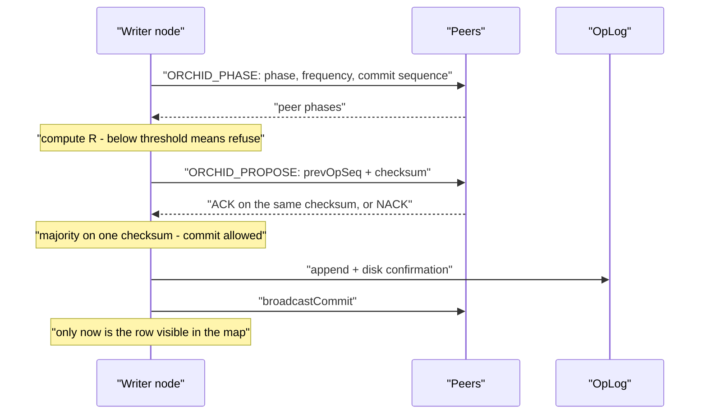

# ORCHID consensus

Three nodes, one database, the client sends `UPSERT`. Two things must hold at once: **admit a write only when the cluster is synchronized**, and **never let a network cut leave different versions of the same data in the journals**.

In a Raft-style stack nodes elect a leader and only the leader writes; when the leader is gone, they elect again. Grid admits writes differently. There is no election. Nodes exchange a **phase** value (coupled oscillators after Kuramoto) and separately confirm each operation with a **checksum** of its contents (*digest*). That protocol is **ORCHID**.

Recovery after failure is re-sync of phases plus checksum agreement — not a new election.

## Terms in one table

| Concept | Meaning |
|---------|---------|
| Order parameter `R` | How close node phases are. Writes are admitted when `R ≥ order-threshold` |
| Writer node | Among synced nodes, the one with minimal `nodeId`. Only it assigns the next operation number (*phase-ranked proposer*) |
| Checksum agreement | A majority from the **configuration** confirms **the same** checksum before a commit becomes visible |
| `OrchidNotSyncedException` | Write refused: either `R` is below threshold, or there is no checksum agreement |
| Solo mode | A node writes alone only if the peer list was empty from the start (`N = 1`) |

Defaults: `coupling: 15.0`, `natural-freq-hz: 1.0`, `order-threshold: 0.85`, `tick-ms: 10`, `digest-quorum: MAJORITY`.

## Two questions

Keep them apart — they fail and are observed differently.

| | Phase synchronization | Checksum agreement |
|--|-----------------------|--------------------|
| Question | May the cluster propose a write right now? | Is this the same operation the others see? |
| Scope | Live peers in the local site | Configured local-site nodes plus self; optionally remote voters |
| Observed as | `orderParameterR`, who is writer | ACK / NACK on a proposal, `pendingProposeAgeMs` |
| Failure | `OrchidNotSyncedException` before any proposal | A proposal that never reaches majority |
| Can be skipped | Never | Never — phase does not replace the checksum |

## How a write proceeds



*Figure 1. Agreement and the journal come before visibility. Better a client error than a half-applied row.*

1. Nodes exchange `ORCHID_PHASE`: phase, frequency, last commit sequence, and when needed the proposal checksum.
2. `R` is computed from live peers seen. Below threshold — the write is not admitted.
3. The writer sends `ORCHID_PROPOSE` with the previous operation sequence. Competing proposals get NACK.
4. A majority of confirmations on one checksum means the operation may commit.
5. The record is appended to the OpLog and confirmed on disk (`confirmPersisted`) **before** the commit broadcast and before the row appears in the map.
6. The last confirmed commit sequence is stored in `orchid/state.bin`.

A node that sends HELLO with the same `clusterId` joins the peer list automatically. The YAML list is an introduction set, not rigid membership. Checksum majority size uses the **configured** list, not whoever answered this moment.

## Tuning the oscillator

The phase loop must converge much faster than the phase advances per tick:

```
2 * pi * natural-freq-hz * tick-ms / 1000  ≪  1
```

Defaults `1 Hz` / `10 ms` / coupling `15` lock. Raising `natural-freq-hz` to `50` at the same tick does not: each tick advances too far, `R` falls below threshold, and writes are refused on a healthy cluster.

- Leave defaults unless you have a measured reason.
- Lowering `order-threshold` to “stop the refusals” hides desync and weakens admission.
- `tick-ms` is also a latency floor for admission decisions — do not raise it only to cut background CPU.

## What must not be weakened

### Write admission

- With peers configured, a write requires `R ≥ order-threshold`.
- Solo write is allowed **only** when the peer list was empty from bootstrap (`N = 1`).
- After a partition with `N ≥ 2`, the smaller side does **not** declare itself synced because it sees nobody. An empty live-peer view does not grant the right to write.
- By default `R` is computed **inside the local site**. Remote nodes are out of the phase view. WAN phase coupling is off (`cross-dc.phase-coupling`) and is not the primary consistency path.

### Checksum agreement

- Voters are the **configured** local-site nodes plus self.
- A commit needs a majority on **the same** checksum for `prevOpSeq → next`.
- `forgetPeer` clears the live view but does **not shrink** majority size. You cannot forget a peer to ease your own quorum.
- `SYNC_VOTERS_ACROSS_DC` adds remote-site checksum ACKs (WAN timeout) without pulling remote phases into local `R` while phase coupling is off.

### Operation ordering

- Only the writer assigns operation sequence numbers.
- `opSeq` is global; gaps in one shard stream are normal.
- A structural `UPDATE` becomes an `UPSERT`: the writer merges via `LogicalFieldCursor` / `BlobFieldModifier`; the final row goes to the journal.
- Linearizable reads (what Jepsen checks) are served only by the writer from the committed map.

### Durability

- OpLog append and confirmation happen **before** commit broadcast and before map visibility.
- Peers write their own OpLog on apply.
- No confirmation — the change never becomes visible: better a client error than two journals.

Negative model properties: `~MinorityWrite`, `~ForkedSlot`. Formal model: [orchid-tla](../internal/orchid-tla.md).

## When nodes lose each other

| Situation | Behaviour |
|-----------|-----------|
| `N = 3`, one node isolated | Isolated node refuses writes; the two continue |
| `N = 3` split 2 / 1 | Only the side of two can reach checksum majority |
| `N = 2` split 1 / 1 | Nobody writes — the price of not forking journals |
| Link heals | Phases converge again; the lagging node catches up the journal; no election |
| Restart after crash | Reads `orchid/state.bin`, replays the journal tail |

There is no “elect myself writer because others are gone”. Client hand-off uses `ServerMeta` / `PROMOTE_NOTIFY` and `rediscoverWriter()`, not rotating URL hosts: [promote a node](../configure-and-operate/operations/ha-promote.md).

## What ORCHID does not do

`OrchidNode` metrics (`orderParameterR`, `getPhaseRankedProposerId`, `pendingProposeAgeMs`) are observation only. They do not replace checksum agreement and are not a Raft leader API.

Where shards live is a separate problem: [shard placement](overlay-and-swarm.md). Claim boundaries: [bio-inspired](bio-inspired.md).

Writer role for clients: [promote a node](../configure-and-operate/operations/ha-promote.md).

## What an operator sees

| Symptom | Where to look |
|---------|----------------|
| `OrchidNotSyncedException` on write | `R` below threshold or no checksum majority — [monitoring](../configure-and-operate/monitoring.md) |
| `R` never settles | Check `natural-freq-hz` against `tick-ms` |
| Growing `pendingProposeAgeMs` | Proposals miss majority: peer down, WAN timeout, network |
| Growing `orchidWaitP50/P99Ns` | Admission is the write ceiling — [capacity](../performance/capacity-slo.md) |
| Client stuck on old writer | Missing `PROMOTE_NOTIFY` or no `rediscoverWriter()` |
| Solo write after partition | Forbidden: empty peer list only at bootstrap with `N = 1` |

Next: [replication network](replication-network.md), [write path](write-path-staging.md), [replication configuration](../configure-and-operate/configuration/replication.md), [multi-site](../configure-and-operate/operations/multi-dc.md).
