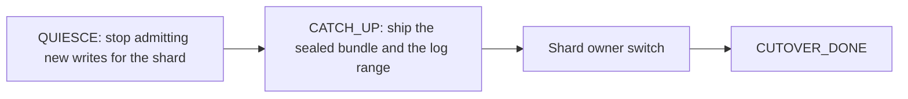

# Shard placement: pins and adaptive moves

Two related pieces sit on top of the placement map. A **pin (`PIN`)** is a mark that says "do not move this key for now". **Adaptive moves (swarm)** are hints and plans for when shard ownership should pass to another node. Together they keep placement predictable under load. In config and metrics the names stay technical: `overlay`, `AdaptiveReplicaSwarm`, `apply-auto-cutover`.

When replication is enabled, shard ownership is not fixed forever. `AdaptiveReplicaSwarm` watches node sensors and may decide to move a shard elsewhere. On average this helps the cluster, but sometimes a move costs more than it saves — and then you need a way to say "leave this key alone for now". That way is `PIN`.

One common misunderstanding to clear up immediately: `PIN` here has **nothing to do** with pinning a buffer or a query plan, the way Oracle or SAP use the word. This is about shard placement, not about caches and not about plans.

## What the swarm does

`AdaptiveReplicaSwarm` collects local sensors and turns them into placement hints.

| Sensor | What it shows |
|--------|---------------|
| `applyLag` | How far journal apply lags behind on the node |
| `queueDepth` | Write queue depth |
| `heapPressure` | Memory pressure |
| `hitRate` | Working-set hit ratio |
| `rttMs` | Network latency to the peer |

A combined score is computed over `score-window-ms`, and once it crosses `migrate-threshold` a `PlacementHint` is produced.

| Hint | Meaning |
|------|---------|
| `KEEP` | Placement is fine; do not move |
| `SHED_LOAD` | This node is carrying too much; prefer moving work away |
| `ATTRACT_LEARNER` | Bring a catch-up node closer to this data |
| `PREFER_DC` | Placement should favour a particular data centre |

Hints affect how urgently changes are shipped and how catch-up is prioritized, but they **never block** journal catch-up when a node joins. A `KEEP` hint must not be able to postpone catch-up indefinitely — that would turn a placement heuristic into a consistency problem.

If a hint grows into a decision to move a shard, `ShardMigrator` runs.

## How shard ownership moves



*Figure 1. The move travels over the same journal as ordinary replication.*

Safety rules for a move:

1. The owner switch is possible only after the drain has entered the `CATCH_UP` phase.
2. Data travels the same durable path: journal shipping over Netty with a write acknowledgement before visibility. There is no "silent" map overwrite. During `CATCH_UP` the shard's sealed artifacts (`.gmap`, `.sbpt`, `.sbm`) are shipped as well, when they are attached.
3. Explicit affinity in `ShardPlacementMap` outranks a one-off target peer choice.
4. An empty catch-up range does not get in the way — it just means the peer has already caught up. A non-empty range is shipped first as a checksum-verified segment.
5. Node join and sparse catch-up always pull the journal tail.
6. A live `PIN` on a shard cancels the move of exactly that shard. An open transaction may suppress the whole tick.

**Ownership cutover** is the last step: after journal catch-up and the sealed package, the shard changes owner (`CUTOVER_DONE`). While a `PIN` is alive on a key of that shard, that step does not run for it.

### Automatic cutover

`grid.replication.swarm.apply-auto-cutover` is `true` by default: a placement plan actually calls `ShardMigrator.migrateRange`. With `false` the tick still scores sensors and emits hints, but no migration is executed.

Turning it off is a **temporary** suppression measure under load, not a steady-state configuration. Left off, the cluster keeps computing plans it never applies and placement drifts further from what the sensors recommend.

What to verify on your topology after enabling it:

1. QUIESCE → CATCH_UP → owner switch completes without an OpLog checksum mismatch, and ownership moves only through journal shipping.
2. An incomplete transaction holds `CATCH_UP` without leaking ownership.
3. A `PIN` on a key blocks migration of **its** shard only; other shards still move.
4. An open SQL transaction may suppress the whole tick, while a pin stays shard-scoped.
5. A durable pin survives a restart until `UNPIN` or TTL expiry.
6. Voter-set hints do not produce two writers together with the client pin (`ServerMeta`, `PROMOTE_NOTIFY`).

### Voter-set hints

```yaml
grid.replication.placement-optimizer:
  voter-set-hints-enabled: true
  target-remote-voters: 1
  apply-voter-set-hints: true   # default on; false = hints and metrics only
```

With `apply-voter-set-hints: true` the swarm tick applies the recommendation through `OrchidNode.applyRemoteVoters` — **remote digest voters only**. The local order parameter `R` is unchanged, so this never affects local write admission. `PeerEndpoint` carries a `PeerRole` (`VOTER` or `LEARNER`), and remote peers are tagged from the multi-DC configuration.

## What PIN does

`PIN` is an annotation in `OverlayStore`: a table plus a key hash, optionally with a time to live and a quality-of-service label.

| Does | Does not |
|------|----------|
| Annotate "better not to move this key right now" | Pin the row in memory forever |
| Make the swarm tick skip the move while the annotation lives | Replace placement affinity in `ShardPlacementMap` |
| Optionally persist to disk under `overlay/` | Act as a second row store |
| Show up in the `overlayPinnedKeys` metric | Optimize the voter set |

And what `PIN` definitely does not touch:

- row bytes, the journal, and ORCHID — it is not a data change;
- the SQL query plan;
- the working set and sealed files — eviction and load-in proceed as usual;
- transactions and record locks — fully orthogonal.

`UNPIN` removes the annotation. Once the last annotation is removed, or its time to live expires, the move becomes possible again.

### Three mechanisms that sound alike

| Mechanism | Question it answers | Lifetime |
|-----------|---------------------|----------|
| `PIN` | May this key's shard be moved right now? | TTL or explicit `UNPIN` |
| Affinity in `ShardPlacementMap` | Where should this shard live by policy? | Configuration |
| `writerEligible` | Which node may accept writes? | Cluster state, per epoch |

Mixing them up is the single most common source of placement confusion.

## When you need it

Four typical situations the mechanism was built for:

**A large tenant at peak.** A single `tenant_id` produces the bulk of writes into a shard. The swarm wants to move it, and catch-up will raise tail latency for exactly that tenant. Placement is frozen for the duration of the peak and released afterwards.

**A freeze during an incident.** A node is behaving erratically and logs and metrics are being collected from it. While the investigation is ongoing, there is no need to shuffle placement.

**A long-lived session.** A game or billing session is bound to a `session_id`, and a move mid-session causes extra network round trips. The annotation is set at login and cleared at logout; the time to live is chosen as the maximum idle period plus headroom, so that an application crash does not leave the annotation forever.

**A small, stable settings table.** It is updated rarely, but neighbouring hot keys keep shuffling the shard. The annotation is set without a time to live, until explicitly removed.

There is also an automatic variant — a short annotation after a write (`auto-pin-ttl-ms`). It is off by default, and enabling it on a cluster with bulk loading is usually a bad idea: a wide set of written keys will freeze too many shards.

Syntax, parameters and step-by-step operational scenarios: [overlay and PIN](../configure-and-operate/configuration/overlay-pin.md).

## What not to do

| Do not | Why |
|--------|-----|
| Treat `PIN` as a buffer or plan pin | This is about shard placement, an entirely different mechanism |
| Pin every key of a transaction "just in case" | The cluster stops balancing |
| Use `PIN` instead of durability and consistency | ORCHID, the journal and transactions are responsible for that |
| Leave permanent annotations without review | Placement freezes in a suboptimal state |
| Enable a large automatic time to live during bulk loading | Moves are suppressed permanently |
| Expect one pin to stop the whole swarm | Only that key's own shard is blocked; other shards still move |

## Observability

What to check after setting an annotation:

1. The `overlayPinnedKeys` metric has grown.
2. `isOverlayBlockingSwarmMigrate()` returns `true`.
3. No applied moves within the annotation's window.
4. If disk persistence is enabled, the annotation survives a node restart.

The swarm side is visible through the `swarm_hint` gauge and the readiness details. Metrics and dashboards: [monitoring](../configure-and-operate/monitoring.md).

## Related

[replication network](replication-network.md), [replication state](replication-state.md), [claim boundaries](bio-inspired.md), [overlay and PIN](../configure-and-operate/configuration/overlay-pin.md), [replication configuration](../configure-and-operate/configuration/replication.md).
