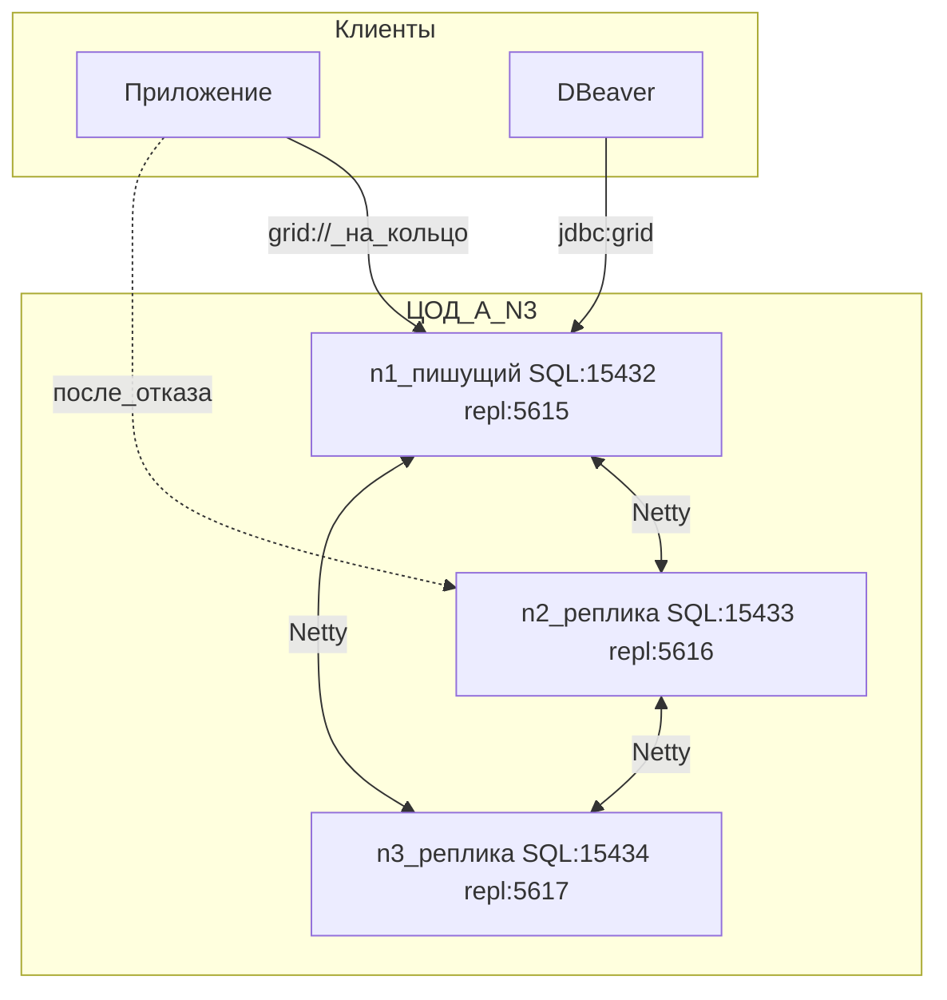
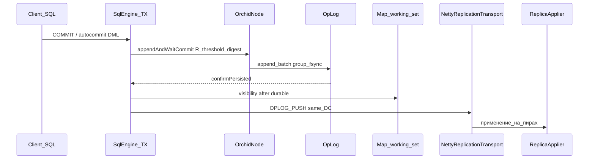
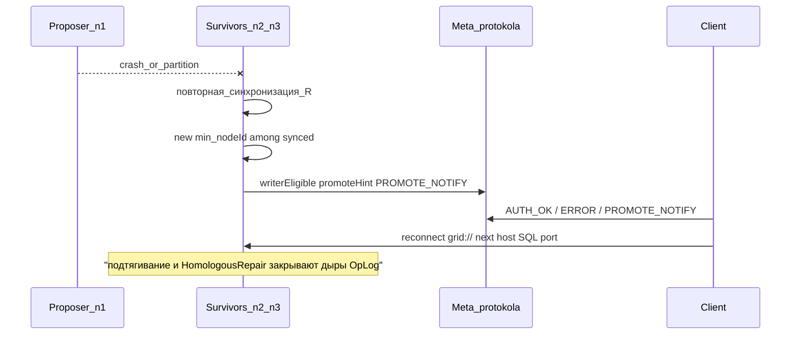

# HA в одном ЦОД под нагрузкой

Отказоустойчивость внутри одного ЦОД держится на ORCHID: узлы синхронизируют фазу (связанные осцилляторы по модели Ёсики Курамото) и подтверждают запись кворумом по digest. Выборов в духе Raft — с термами и голосованием — здесь нет.

Важно различать два канала. Приложения ходят по **SQL TCP**, узлы между собой — по **отдельному порту репликации**.

## Порты

| Порт (по умолчанию) | Протокол | Кто подключается |
|---------------------|----------|------------------|
| **15432** | SQL, бинарные LE-кадры (`grid://`, `jdbc:grid://`) | Приложения, DBeaver, Jepsen |
| **5615** (+1 на каждый следующий узел) | Репликация по Netty (`OPLOG_PUSH`, ORCHID, подтягивание) | Только узлы кластера |

SQL-клиент, направленный на `5615`, ломает разбор кадров — соединение не поднимется. Подробности протокола: [сеть репликации](../../understand/replication-network.md).

Ещё две заметки, которые экономят время:

- `jdbc:grid://` — JDBC-клиент в `grid-sql-client` (сервисы и DBeaver). Reactive-путь — `ConnectionFactory` и `grid://`.
- Для SIMD-ускорений JVM нужно запускать с `--add-modules=jdk.incubator.vector`.

## Топологии в одном ЦОД

Пара 1+1 для быстрого старта: [запуск кластера](../../getting-started/start-cluster.md). Ниже — кольцо из трёх узлов.

### Топология N=3



- **Пишущий узел** — `min(nodeId)` среди синхронизированных (`phaseRankedProposer`; флаг `writerEligible`).
- **Реплики** получают OpLog асинхронно в пределах ЦОД. Небольшое отставание — ожидаемое поведение, см. [повышение роли узла](ha-promote.md).
- У каждого узла **свой** `dataDir`. Общий NFS или SAN на весь кластер не поддерживается.

## Путь записи



Ключевой момент: строка становится видимой в памяти только **после** того, как она записана в OpLog и подтверждена кворумом. Если на любом из этих шагов происходит ошибка, изменение не применяется — клиент получает отказ, а не молча потерянный коммит.

Как это устроено внутри: [обзор архитектуры](../../understand/architecture-overview.md), [путь записи](../../understand/write-path-staging.md), [хранение GMAP](../../understand/storage-sealed-gmap.md).

## Переключение writer при отказе



Выжившие узлы заново сходятся по фазе, новый `min(nodeId)` среди синхронизированных берёт на себя запись, а дыры в журнале закрывает HomologousRepair. Пошаговый разбор и действия оператора — в [повышении роли узла](ha-promote.md).

### Строка подключения клиента

Опорный вид — перечислить SQL-порты всех узлов кольца адресов записи через запятую. Клиент держится за живой TCP и переходит к следующему адресу, когда соединение обрывается или не устанавливается:

```
grid://u:p@n1:15432,n2:15433,n3:15434/public?connectTimeoutMs=1000&retryMode=FIXED&maxRetries=2
```

Тот же кластер, поднятый локально через Docker Compose с пробросом портов на хост:

```
grid://u:p@127.0.0.1:15432,127.0.0.1:15433,127.0.0.1:15434/public?connectTimeoutMs=1000&retryMode=FIXED&maxRetries=2
```

| Параметр | Зачем нужен |
|----------|-------------|
| Все узлы кольца в списке адресов | После падения proposer клиент переедет на выживших |
| `connectTimeoutMs` | Быстрее отказаться от мёртвого узла |
| `retryMode` и `maxRetries` | Повторы подключения по списку адресов |
| `maxTxContexts` | потолок логических сессий на **одном** TCP, а не пул из N сокетов |

**Как это делать в продакшене.** Выбор writer берётся из `ServerMeta`, который приходит по протоколу в `AUTH_OK`, в `ERROR` и в асинхронном `PROMOTE_NOTIFY`: клиент закрепляется на узле с `writerEligible` и, если включена изоляция площадок, с совпадающим `regionEpoch`. Если посреди операции узел отклонил запись из-за рассинхронизации, отставания или несовпадения epoch, не переключайте соединение молча: вызывайте `rediscoverWriter()`. Полный сценарий: [повышение роли узла](ha-promote.md).

## Kubernetes и пробы Actuator

Включите пробы (`management.endpoint.health.probes.enabled: true`) и откройте группы `health,prometheus`. В readiness добавьте `gridReadiness` — пример есть в `application.yml` модуля `grid-sql-server-starter`.

| Путь (starter, `base-path: /`) | Что проверяет |
|------|---------------|
| `/health/liveness` | Процесс жив (`livenessState`) |
| `/health/readiness` | Узел готов принимать трафик: SQL TCP слушает (если включён) и узел либо одиночный durable, либо синхронизирован по ORCHID |
| `/prometheus` | Сбор метрик Micrometer / Prometheus |

Если оставлен стандартный базовый путь Spring, те же группы — под `/actuator/health/*` и `/actuator/prometheus`.

Что именно попадает в детали probe и какие метрики смотреть: [мониторинг](../monitoring.md).

## Рецепт YAML для нагруженного кластера

Отправная точка для высокой пропускной способности записи с групповым fsync. Значения обязательно перепроверять на своём железе прогонами Jepsen и QG.

```yaml
grid:
  durability:
    enabled: true
    hydrate-mode: LAZY
    working-set-max-entries: 2_000_000
  sql:
    default-shards: 16
  sql-server:
    enabled: true
    host: 0.0.0.0
    port: 15432
  replication:
    enabled: true
    node-id: n1
    cluster-id: prod-dc-a
    orchid:
      coupling: 15.0
      natural-freq-hz: 1.0
      order-threshold: 0.85
      tick-ms: 10
      digest-quorum: MAJORITY
    repair:
      homologous-enabled: true
      reconcile-interval-ms: 5000
    swarm:
      enabled: true
      score-window-ms: 5000
      migrate-threshold: 0.3
    placement-optimizer:
      enabled: true
    transport:
      bind-host: 0.0.0.0
      bind-port: 5615
      peers:
        - { id: n2, host: n2.internal, port: 5615, dc: dc-a }
        - { id: n3, host: n3.internal, port: 5615, dc: dc-a }
    cross-dc:
      enabled: false
    op-log:
      data-dir: ./data/n1/replication
      fsync: true
    flow:
      max-inflight-ops: 20000
```

### Что крутить под нагрузкой

| Параметр | Роль |
|----------|------|
| `op-log.fsync` | Сохранность данных; пакетная запись амортизирует групповой fsync |
| `orchid.tick-ms` и `order-threshold` | Допуск записи; держите произведение `2*pi*freq*tick/1000` заметно меньше единицы |
| `sql.default-shards` | Параллелизм шардов при CREATE TABLE |
| Параллельные TX на одном TCP | Жёсткий потолок канала **8**; Boot не применяет `grid.sql.max-tx-contexts` к слушателю — откройте больше `Connection` ([SQL-сервер](../configuration/sql-server.md)) |
| `durability.working-set-max-entries` и `hydrate-mode` | Компромисс между потолком RAM и промахами в запечатанном хранилище |
| `swarm`, `placement-optimizer` | Подсказки по размещению; `apply-auto-cutover` по умолчанию **true** ([overlay и размещение](../../understand/overlay-and-swarm.md); `false` — только временное подавление migrate) |

## Чем проверять

| Контур | Где |
|--------|-----|
| Внешний Jepsen N=3 | [benchmarks/jepsen/README.md](../../../../benchmarks/jepsen/README.md) |
| Chaos-тесты | `index.unit.replication.chaos.**` |
| Переключение writer и окно потерь | [повышение роли узла](ha-promote.md) |
| Протокол и репликация между ЦОД | [сеть репликации](../../understand/replication-network.md) |
| Пороги пропускной способности | [ёмкость и пороги](../../performance/capacity-slo.md) |

Проверки согласованности и нагрузочные прогоны запускают **по одному** на спокойной машине — иначе цифры недействительны. Порядок: [методика](../../performance/methodology.md).

**Связанное:** [несколько ЦОД под нагрузкой](cluster-multidc-highload.md), [Compose-развёртывание](deploy-compose.md), [чтение с реплики](replica-reads.md), [отказы](failures.md).
