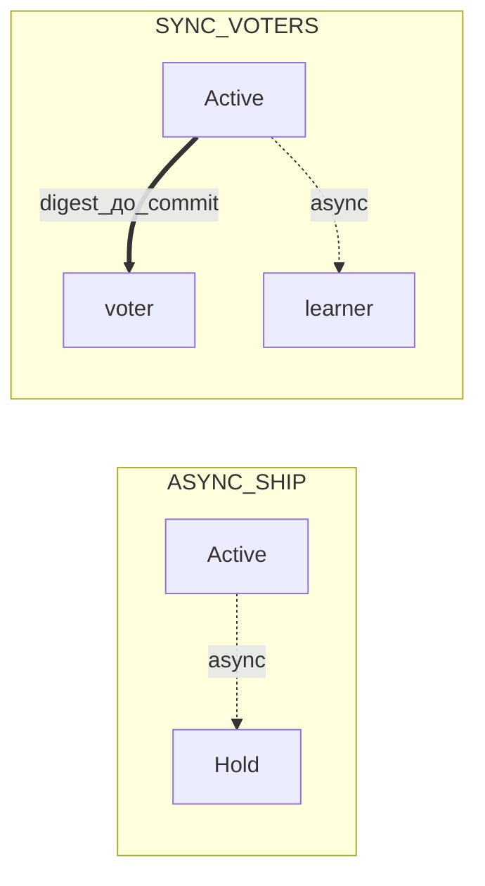

# Несколько ЦОД

Короткая страница для оператора: какие роли бывают у ЦОД, какой режим репликации выбрать и как в этом случае подключать клиента. Разбор топологий, рецепты YAML и измерения — в [нескольких ЦОД под нагрузкой](cluster-multidc-highload.md).

## Роли ЦОД

Запись в каждый момент времени принимает ровно один ЦОД. Роль задаётся на узле ключом `grid.replication.region.role`.

| Роль | Принимает запись | Назначение |
|------|------------------|------------|
| `ACTIVE` | Да, если узел ещё и проходит допуск ORCHID | Текущее кольцо адресов записи; владеет счётчиком `regionEpoch` |
| `HOLD` | Нет, но может забрать роль | Резервный ЦОД: догоняет по журналу, готов стать Active |
| `WITNESS` | Нет | Арбитр: только голосует при передаче роли |

### Роль → пишет / читает

| Роль | Запись DML/TX | SELECT (если разрешено политикой) |
|------|---------------|-----------------------------------|
| Active (+ допуск ORCHID) | Да | Да |
| Hold | Нет | Да, при контролируемом отставании; иначе отказ |
| Witness | Нет | Нет |

Передача роли происходит, когда Active замолчал дольше `claim-timeout-ms`, а Hold набрал кворум подтверждений (`quorum-size`). После этого `regionEpoch` увеличивается на единицу. Ожившая бывшая Active-площадка сама в Active не возвращается — она переходит в Hold.

Изоляция площадок включается ключом `grid.replication.region.enabled`. По умолчанию он выключен, и тогда действует прежняя схема с фиксированным основным ЦОД.

## Режимы репликации между ЦОД

Режим задаётся в `grid.replication.cross-dc.mode`.

| Режим | Что происходит | Чем платим |
|-------|----------------|------------|
| `ASYNC_SHIP` | Транзакция фиксируется локально, журнал уходит в резервный ЦОД асинхронно | Отставание резерва: часть последних записей может не доехать |
| `SYNC_VOTERS_ACROSS_DC` | Commit ждёт подтверждения от удалённых голосующих узлов (потолок ожидания — `remote-ack-timeout-ms`) | Каждая запись оплачивает круговую задержку WAN |

Полные карты узлов и измерения: [несколько ЦОД под нагрузкой](cluster-multidc-highload.md).

Выбор между ними — это выбор между задержкой записи и объёмом возможных потерь при падении целого ЦОД.

### Когда какой режим

| Нужно | Режим |
|-------|--------|
| Минимальная задержка записи; допустим RPO на Hold | `ASYNC_SHIP` |
| Не терять свежие коммиты при падении Active-ЦОД (плата — WAN на каждый commit) | `SYNC_VOTERS_ACROSS_DC` |
| Только читать с Hold при контролируемом отставании | Любой режим + отдельный read URL; см. [чтение с реплики](replica-reads.md) |

### Голосующие и узлы только подтягивания (`cross-dc`)

| Ключ | Смысл |
|------|--------|
| `cross-dc.voters` | Удалённые узлы, которые подтверждают digest в `SYNC_VOTERS_ACROSS_DC`. Пустой список → все удалённые, кроме `learners` |
| `cross-dc.learners` | Узлы только подтягивания: асинхронная доставка журнала; в sync-кворум не входят |
| `cross-dc.phase-coupling` | По умолчанию **выключено** — не смешивать фазы удалённых узлов в локальный `R` |

YAML и нагрузка: [несколько ЦОД под нагрузкой](cluster-multidc-highload.md).

## Что ломается при изоляции площадок

| Симптом | Что делать |
|---------|------------|
| Запись отклонена из‑за `regionEpoch` | Не крутить следующий адрес в URL — вызвать `rediscoverWriter()` ([повышение роли](ha-promote.md)) |
| Два клиента пишут после захвата роли | Проверить, что в URL записи нет Hold/Witness без логики изоляции площадок; один победитель захвата (`claim-timeout-ms`) |
| Readiness DOWN на новом Active | Дождаться ORCHID sync; смотреть `orchid_r` / `writerEligible` в [мониторинге](../monitoring.md) |

## Подключение клиента

Клиент закрепляется на узле с `writerEligible` и актуальным `regionEpoch`. Список хостов в URL — кандидаты на reconnect, а не «round-robin писателей». После смены Active вызывайте `rediscoverWriter()`, а не следующий адрес вручную.

| Конфигурация | Что писать в строке подключения |
|--------------|----------------------------------|
| Изоляция площадок выключена | Только адреса узлов Active-ЦОД |
| Изоляция площадок включена | Можно перечислить узлы обоих ЦОД; клиент всё равно закрепится на узле с `writerEligible` и совпадающим `regionEpoch` |
| Чтение с Hold | Отдельная строка подключения только на узлы Hold |

Узел с ролью Hold или Witness примет TCP-соединение, но запись отклонит. Чтение с Hold возможно, если приложение готово получить отказ при большом отставании: устаревшие данные вместо ошибки не отдаются. Witness не обслуживает ни запись, ни чтение.

Если узел отклонил операцию из-за несовпадения `regionEpoch`, клиент не должен молча переключаться на следующий адрес — иначе есть риск получить двух пишущих. Правильное поведение — `rediscoverWriter()`, подробности в [повышении роли узла](ha-promote.md).

## Отказ Active-ЦОД

Когда Active замолкает дольше `claim-timeout-ms`, Hold набирает кворум подтверждений (`quorum-size`), `regionEpoch` увеличивается на единицу, и новый Active принимает запись. Клиент **не** крутит следующий host в URL: вызывает `rediscoverWriter()` и закрепляется на узле с `writerEligible` и новым epoch. Подробный YAML и нагрузка — [несколько ЦОД под нагрузкой](cluster-multidc-highload.md).

**ASYNC_SHIP.** Commit остаётся локальным; журнал уходит на Hold асинхронно. При потере Active возможна потеря свежих коммитов в пределах отставания (RPO на Hold) — это плата за низкую задержку записи.

**SYNC_VOTERS_ACROSS_DC.** Commit ждёт digest с удалённой площадки. При падении Active свежие коммиты, прошедшие кворум, уже на Hold — плата: WAN на каждый commit.

### Периодичность учебной проверки (потеря Active / возврат)

На лабораторном или запасном стенде (не на пике записи единственного живого Active) периодически:

1. Зафиксировать одного Active и известный `regionEpoch` до проверки.
2. Сымитировать молчание Active дольше `claim-timeout-ms` (или корректно остановить узлы Active на стенде).
3. Проверить claim на Hold: новый Active, `regionEpoch` +1, readiness UP, `writerEligible` у победителя.
4. Клиент: `rediscoverWriter()` — не следующий host в URL; проверочная запись проходит только на новом Active.
5. Возврат: бывший Active снова как Hold (или по вашей топологии), дождаться подтягивания, зафиксировать окно RPO для `ASYNC_SHIP` против почти нулевого отставания digest для `SYNC_VOTERS`.

**Проверка RPO.** Для `ASYNC_SHIP` снимите отставание Hold (`rpoEstimateMs` / apply lag) до закрытия учебной проверки. Для `SYNC_VOTERS` убедитесь, что удалённые голосующие были в пути кворума. Нагрузка и YAML: [несколько ЦОД под нагрузкой](cluster-multidc-highload.md).

## Стенды

Готовые compose-топологии `multidc-async` и `multidc-sync` описаны в [Compose-развёртывании](deploy-compose.md). Оба стенда занимают одни и те же порты, поэтому поднимайте по одному.

Инциденты: [отказы](failures.md). Текущие ориентиры для планирования — [ёмкость и пороги](../../performance/capacity-slo.md).

**Связанное:** [повышение роли узла](ha-promote.md), [отказы](failures.md), [настройка репликации](../configuration/replication.md), [сеть репликации](../../understand/replication-network.md), [мониторинг](../monitoring.md).
