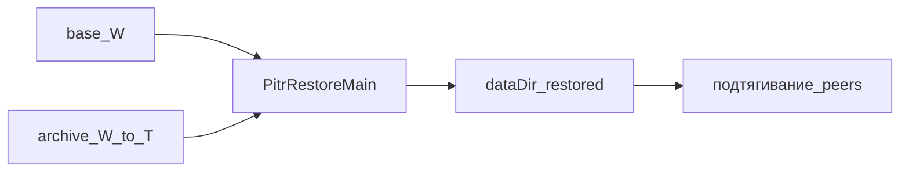

# Восстановление на момент времени (PITR)

Восстановление узла на логический ORCHID seq `T` из sealed **base** и архива OpLog.

PITR — про сохранность и откат, не про TPS. Не ослабляйте ORCHID, fsync и опорные пороги ради «быстрого» backup.

## Расписание до инцидента

| Шаг | Когда | Действие |
|-----|-------|----------|
| Включить archive | До первой нагрузки, которую хотите откатывать | `oplog-archive.enabled: true`, свой `dir` на узел |
| Base backup | По расписанию (суточно / перед релизом) | Снять sealed + orchid state на watermark `W` (`SealedBaseBackupUtil`) |
| Проверка покрытия | После truncate / регулярно | Archive покрывает хвост после `W`; иначе restore до `T > W` оборвётся |
| Учебное восстановление | На копии `dataDir`, не на живом writer | Прогнать `PitrRestoreMain --until-seq` offline |

Без включённого archive в момент аварии восстанавливать нечего.

**Периодичность учебной проверки.** После включения archive и первого base backup периодически восстанавливайте на **копии** `dataDir` (никогда на живом writer): убедитесь, что покрытие за watermark `W`, затем `PitrRestoreMain --until-seq`. Провал учебной проверки — дефект эксплуатации до реального инцидента.

## Короткий сценарий инцидента

1. **Инцидент.** Остановить узел; не писать в повреждённый `dataDir`.
2. **Base.** Иметь (или установить) sealed base на watermark `W ≤ T` через `SealedBaseBackupUtil` — см. [резервное копирование](backup-restore.md).
3. **Офлайн-восстановление.** Пустой `dataDir` → установить base → `PitrRestoreMain --until-seq T` → replay архива `[W+1 … T]`.
4. **Вернуть в кластер.** Поднять узел; догонять реплики. При Multi-DC учитывать `regionEpoch`.



## Модель

1. **Base** — sealed `.gmap` / `.sbpt` / `.sbm` плюс orchid `state.bin`, locus и `index-ckpt` на watermark `W ≤ T`.
2. **Archive** — сегменты OpLog `[W+1 … T]` вне живого `dataDir` (локальный диск узла; не общий NFS/SAN).
3. **Restore (offline)** — пустой `dataDir` → base → replay до `--until-seq T` → `discardOpenTxStaging`.
4. **Кластер** — один узел, затем подтягивание реплик (SparseCatchUp / HomologousRepair).

Порядок задаёт seq. Карта wall-clock → seq — отдельные операционные метаданные.

## Что не восстанавливается

| Состояние | После restore |
|-----------|----------------|
| Открытые (dirty) транзакции до COMMIT | Нет — их не было в OpLog |
| Рабочий набор в RAM | Пересоберётся (LAZY/FULL hydrate) |
| Чужой `cluster-id` / чужой epoch | Узел не «подменит» пиров сам — нужна правильная конфигурация |

## Настройки

```yaml
grid:
  durability:
    oplog-archive:
      enabled: false
      dir: ./data/oplog-archive
      stream-enabled: false
      stream-dir: ""            # пусто → {dir}/stream при stream-enabled
```

| Параметр | Эффект |
|----------|--------|
| `oplog-archive.enabled` | Перед truncate копировать диапазон в archive; ошибка I/O **отменяет** truncate |
| `oplog-archive.dir` | Корень архива (layout с заменой segment) |
| `oplog-archive.stream-enabled` | Дозапись архива на другой узел при безопасном truncate после подтягивания |
| `oplog-archive.stream-dir` | Корень stream; пусто → `{dir}/stream` |

I/O архива — синхронно на вызывающем потоке; не с Netty EL.

## Инструменты

| Класс | Пакет | Роль |
|-------|-------|------|
| `OpLogArchiveUtil` | `org.genfork.grid.replication.util` | Архив / archive-before-truncate |
| `OpLogArchiveStreamer` | `org.genfork.grid.replication.util` | Поток OpLog на дозапись за пределы узла |
| `SealedBaseBackupUtil` | `org.genfork.grid.replication.snapshot` | Base backup / install `dataDir` |
| `PitrRestoreMain` | `org.genfork.grid.replication.pitr` | CLI restore до seq |
| `PitrCoordinatedRestore` | `org.genfork.grid.replication.pitr` | Восстановление между ЦОД при ограждении Active |
| `PitrActiveFence` | `org.genfork.grid.replication.pitr` | Отказ при ошибке: Active / два пишущих |

```text
java --enable-preview -cp ... org.genfork.grid.replication.pitr.PitrRestoreMain \
  --base ./backup/base-W \
  --archive ./data/oplog-archive \
  --data-dir ./data/replication/cluster/node-restored \
  --until-seq 125000 \
  --domain my.Table \
  --shard 0
```

Согласованное восстановление между ЦОД: `PitrCoordinatedRestore.restoreUnderActiveFence(ACTIVE, remoteAlsoActive=false, …)` — отказ, если сайт не Active или удалённый peer тоже Active.

## Что не делать

- Включать `oplog-archive` только в момент аварии — архива не будет.
- Писать в повреждённый `dataDir` «на всякий случай» — размазываете дыру.
- Ставить restore в общий NFS/SAN на весь кластер — каталог только на узел.
- Восстанавливать сразу все ЦОД без изоляции Active-площадки — риск двух пишущих.

## Симптомы сбоя restore

| Симптом | Частая причина |
|---------|----------------|
| Replay обрывается / пустой диапазон | Archive не покрывает `[W+1 … T]` или archive выключен |
| Seq не совпадает с ожиданием | Неверный `--until-seq` или base с другого watermark |
| Узел не догоняет peers | Чужой `cluster-id` / epoch; общий dataDir; смотреть HomologousRepair |
| После restore «пропали» открытые TX | Ожидаемо: dirty до COMMIT не в OpLog |
| Restore отклонён (ограждение Active) | Сайт Hold/Witness или два пишущих / два Active |

**Связанное:** [долговременное хранение](../configuration/durability.md), [хранение GMAP](../../understand/storage-sealed-gmap.md), [отказы](failures.md), [обновление узла](upgrade.md).