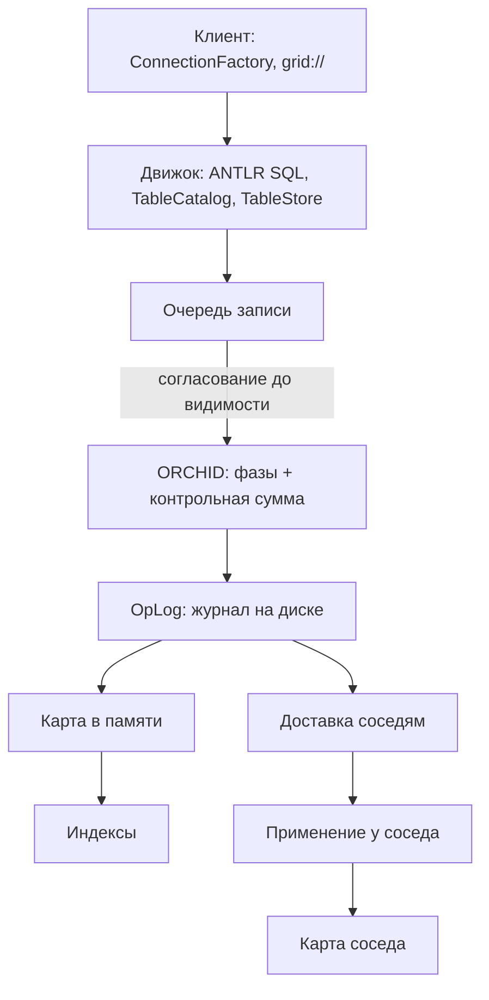

# Обзор архитектуры

Клиент шлёт SQL. Строка должна либо появиться у всех согласованно, либо не появиться ни у кого. При записи на диск путь такой: допуск ORCHID → подтверждение в журнале (*OpLog*) → карта в памяти и индексы → при необходимости доставка соседним узлам. Пока диск не подтвердил, другие сессии не видят строку как зафиксированную. Лучше отказ клиенту, чем «в памяти уже есть, на диске ещё нет».

Ниже — как устроен этот путь и из каких частей собран продукт. Подробности слоёв — по ссылкам в таблицах.

## Путь одного запроса

Сначала человеческая цепочка, потом имена в схеме:

1. Клиент (`grid://` или `jdbc:grid://`) → разбор SQL и каталог таблиц.
2. Очередь записи → ORCHID (фаза + контрольная сумма) → журнал на диске.
3. Только после подтверждения журнала — карта в памяти и индексы.
4. Журнал уходит соседним узлам; они применяют его у себя.

*Схема 1. Согласование и журнал раньше, чем читатель увидит строку.*

Если ORCHID не допустил запись или журнал не подтвердил сохранение, строка в карте не появляется. Фоновой задачи, которая потом «доедет» и проявит отклонённую запись, нет.

## Из чего собран узел

| Слой | Роль | Подробнее |
|------|------|-----------|
| Клиент | `grid-sql-client`: реактивный (`grid://`) или JDBC (`jdbc:grid://`) | [Java-клиент](../develop/java-client.md), [JDBC-клиент](../develop/jdbc-tooling.md) |
| Движок | ANTLR SQL, каталог, планирование SELECT, коммит TX | [SQL: основы](../sql/fundamentals.md), [матрица](../sql/support-matrix.md) |
| Запись | Очередь, затем согласование и журнал | [путь записи](write-path-staging.md) |
| Хранение | В памяти — горячий набор; на диске — запечатанные файлы и OpLog | [хранение](storage-sealed-gmap.md) |
| Согласование | ORCHID: фазы и контрольная сумма; без выборов лидера как в Raft | [ORCHID](orchid-consensus.md) |
| Репликация | Между узлами — Netty; между ЦОД — `ASYNC_SHIP` / `SYNC_VOTERS_ACROSS_DC` | [сеть репликации](replication-network.md) |
| Размещение | Подсказки переноса шардов; `PIN` временно запрещает перенос | [размещение шардов](overlay-and-swarm.md) |

Источник истины при записи на диск — OpLog и запечатанные файлы; карта в памяти — ускоритель.

## Модули

| Модуль | Что внутри |
|--------|------------|
| `grid-commons` | Общий код на чистом JDK: `SqlType`, `SqlResult`, `SqlFrame`, `ServerMeta`, буферы кодирования. Без Reactor и Netty |
| `grid-sql-antlr` | Грамматика `SimplifiedSql.g4`, сгенерированный парсер и классификатор маршрута на стороне клиента |
| `grid-sql-client` | SQL SPI (`ConnectionFactory`, `TxContext`), кадры протокола, удалённый транспорт на Netty, CLI и JDBC-драйвер для инструментов |
| `grid-server-core` | Хранилище, индексы, `SqlEngine`, транзакции, репликация, SQL-сервер на Netty, автоконфигурация Spring Boot |
| `grid-sql-server-starter` | Запускаемый артефакт сервера (SQL поверх TCP) |

Приложение-потребитель зависит от клиентского модуля и работает через SQL. Ни репозиториев с аннотациями, ни доменных классов-сущностей для отображения нет: схема лежит в каталоге, а не в коде приложения.

## Строка не превращается в объект по дороге

Внутри сервера строка — упакованная двоичная запись с таблицей смещений в конце. `LogicalFieldCursor` читает поле по смещению; ключи соединений, фильтров и индексов остаются `byte[]` либо спанами без копирования поверх этой записи на всём пути конвейера. Разбор в объекты Java происходит только на границах: результат клиенту, текст `EXPLAIN` и литералы, приходящие через SPI.

Отсюда два практических следствия. Добавление колонки через `ALTER TABLE` не переписывает уже сохранённые строки — у старых строк просто нет значения по этому смещению, и оно читается как `NULL`. И выборка двух колонок из широкой таблицы не разбирает строку целиком.

Структурный `UPDATE` подчиняется тому же правилу: сервер читает текущую строку курсором, переписывает затронутые поля через `BlobFieldModifier`, и в журнал уходит финальный набор байтов одним `UPSERT`. Операций уровня хранилища «прибавить единицу» или «дописать в поле» не существует.

## Потоки

| Пул | Потоки | Что там выполняется |
|-----|--------|---------------------|
| Логика | Виртуальные | Исполнение SQL по сессиям, ожидание блокировок записей и коммита |
| CPU | Платформенные, примерно по числу ядер | Параллельный скан, map-reduce, тяжёлое кодирование |
| Ввод-вывод | Платформенные, ограниченный пул | Работа с журналом и запечатанными файлами, копии в архив |
| Циклы событий Netty | Платформенные | Только разбор и сборка кадров |

Правило, которое определяет устройство всего сервера: поток цикла событий Netty никогда не ждёт ни SQL, ни кворума, ни блокировки. Входящие кадры передаются в последовательный почтовый ящик сессии на виртуальном потоке логики, и всё, что может заблокироваться, происходит там. Виртуальные потоки нужны именно для *ожидания* — много одновременных ожиданий блокировок и коммитов стоят почти ничего, — а вычислительная развёртка уходит в ограниченный платформенный пул, чтобы тяжёлый скан не задушил остальной узел.

## Топологии узлов

От одного узла с записью на диск до нескольких ЦОД схемы собраны в эксплуатационных страницах:

- Одиночный узел и пара 1+1 — [запуск кластера](../getting-started/start-cluster.md)
- Кольцо N=3 и отказ с переключением — [HA в одном ЦОД](../configure-and-operate/operations/cluster-ha-highload.md)
- Active/Hold, ASYNC и SYNC — [несколько ЦОД](../configure-and-operate/operations/multi-dc.md)
- Закрепление клиента и узел-свидетель (Witness) — [повышение роли узла](../configure-and-operate/operations/ha-promote.md)

## Рабочий набор, а не весь датасет

Когда включена запись на диск, память — это **рабочий набор**: горячие ключи, которые обслуживают запросы без обращения к диску. Всё остальное лежит в запечатанных файлах и подгружается при промахе. Ограничение задаётся параметром `working-set-max-entries`: холодные закоммиченные ключи вытесняются по LRU, а грязные и ещё не слитые из очереди — никогда.

Поэтому «пустая» куча после рестарта при `hydrate-mode: LAZY` — не потеря данных. Истина лежит на диске, а карта наполняется по мере прихода трафика. Настройка: [долговременное хранение](../configure-and-operate/configuration/durability.md).

## Исполнение тяжёлых запросов

Тяжёлые SELECT идут через адаптивное исполнение (*AQE*): `QueryHeavinessEstimator` оценивает стоимость, `AdaptiveParallelScan` и `AdaptiveChunkScheduler` раскладывают работу по пулу CPU. Дополнительно есть MapReduce по шардам домена (`ShardPartitionPlanner`, `DistributedKeyFanOut.mapReduceByShard`).

Разрешение ключей **по умолчанию локальное**. Старый режим, когда одинаковый SQL рассылался пирам, считается устаревшим и выключен. Развёртка раскладывает по потокам одного узла ключи *своих* шардов; это не распределённый исполнитель запросов.

Остаточные условия равенства считаются на упакованных байтах (`WireResidualBatch`), при желании — с векторными инструкциями через `ArrayVectors`. Для SIMD нужен флаг JVM `--add-modules=jdk.incubator.vector`.

Планы, узлы `AQE_PARALLEL` и `DIST_MAP` в выводе EXPLAIN: [EXPLAIN и AQE](../sql/explain-and-aqe.md).

## Два разных слоя накопления записей

Их легко перепутать, поэтому стоит держать различие в голове:

| Слой | Где лежит | Что делает |
|------|-----------|------------|
| Очередь записи | `GridEntriesProcessor` | Асинхронно сливает изменения в карту. При включённой записи на диск `MutationRecorder` перед этим проводит цепочку ORCHID → OpLog → подтверждение |
| Накопление при применении | `ReplicaApplier`, по паре `(домен, шард)` | Буферизует `UPSERT` и `DELETE` между `TX_BEGIN` и `TX_COMMIT`, сливает на коммите, выбрасывает на откате |

Когда репликация включена, транзакции дополнительно пишут в OpLog маркеры жизненного цикла (`TX_BEGIN`, `TX_COMMIT`, `TX_ABORT`) — тем же путём через ORCHID. Маркеры не заменяют сами строки: изменения данных всё равно проходят полную цепочку. На пире транзакция применяется одним куском, поэтому частично применённых транзакций читатель не видит.

Транзакции на несколько шардов собирает `MultiShardCommitBarrier`: он дожидается потоков всех затронутых таблиц и укладывает в OpLog один блок `TX_BEGIN` → операции → `TX_COMMIT`. Это локальный барьер слива коммита на предлагающем узле, а не распределённый двухфазный коммит поверх чужих менеджеров ресурсов.

Разбор по шагам: [путь записи](write-path-staging.md), [видимость и конкурентность](concurrency-and-visibility.md).

## Чего в архитектуре нет

Чтобы не было ложных ожиданий:

- **Нет выборов лидера в стиле Raft.** Право писать даёт ORCHID: достаточная синхронность фаз плюс согласие по digest.
- **Нет отдельного сервиса авторизации записи.** Опкод `AUTH` на кадрах — вход в каталог пользователей и GRANT (`privileges.meta`), не арбитр коммита и не 2PC. Допуск и сохранность записи решают ORCHID и OpLog. Оператору: [безопасность](../configure-and-operate/operations/security.md).
- **Нет CRDT-слияния нескольких мастеров.** Пиры догоняют журнал и лечатся восстановлением, а не мержем конкурирующих версий.
- **Нет версий-снимков MVCC.** У закоммиченной строки одно текущее значение; конкурирующие писатели упорядочиваются блокировками записей, а не версиями строк — [видимость и конкурентность](concurrency-and-visibility.md).
- **Только кадры Grid** в основном пути приложения: между клиентом и сервером — little-endian кадры продукта.

## Ёмкость

Пропускная способность кластера с включённой записью на диск ограничена двумя вещами: fsync журнала и допуском ORCHID. Это честный потолок, а не «миллионы операций в секунду» из маркетинга. Свободный CPU во время нагрузки на запись не означает запаса — обычно он означает ожидание одного из этих двух. После примерно 128 одновременных клиентов на лабораторном хосте начинается спад.

Результаты прогонов и опорные пороги: [ёмкость и SLO](../performance/capacity-slo.md), [методика](../performance/methodology.md).

## Типичные ошибки чтения архитектуры

| Ошибка | Как на самом деле |
|--------|-------------------|
| «Память — источник истины» | При записи на диск источник — OpLog и запечатанные файлы; память — рабочий набор |
| «Репликация = сохранность» | Это разные выключатели: одиночный узел с записью на диск без пиров нормален |
| «ORCHID — выборы лидера Raft» | Фаза плюс кворум digest, без выборов лидера |
| «PIN — блокировка строки» | PIN про перенос шарда, а не про SQL-блокировки |
| «Развёртка — распределённый SQL» | Развёртка распараллеливает локальные ключи шардов одного узла |

Дальше: [путь записи](write-path-staging.md), [ORCHID](orchid-consensus.md), [хранение](storage-sealed-gmap.md).
