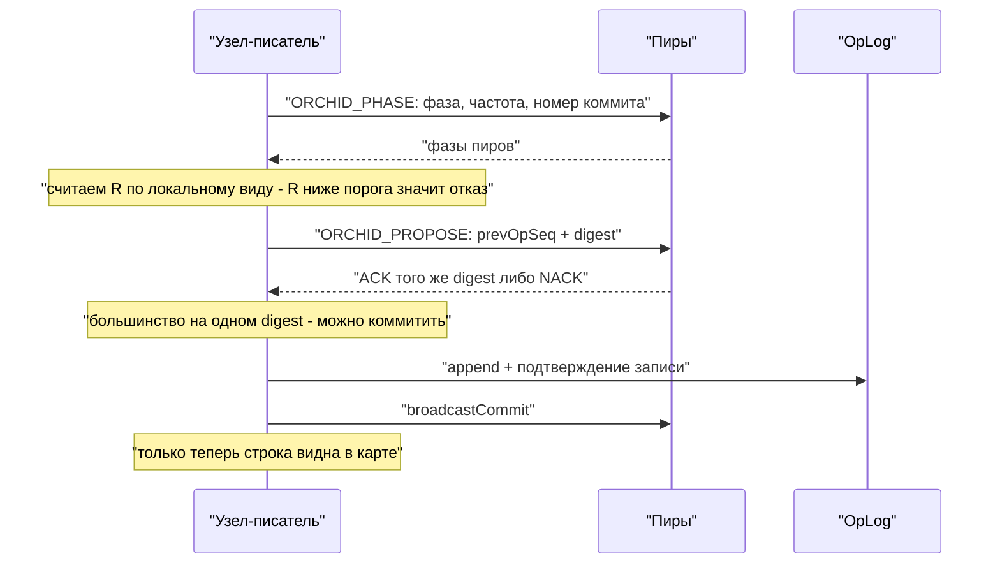

# Консенсус ORCHID

ORCHID решает один вопрос: **можно ли прямо сейчас принять запись и кто её предлагает**. Механизм состоит из двух частей — фазовой синхронизации между узлами (связанные осцилляторы по модели Ёсики Курамото) и согласия по digest для конкретной операции.

Здесь нет ни термов, ни выборов лидера, ни API голосования, как в Raft. Восстановление после сбоя — это повторная синхронизация фаз плюс согласие по digest, а не новые выборы.

## Основные понятия

| Понятие | Смысл |
|---------|-------|
| Параметр порядка `R` | Численная мера того, насколько узлы синхронны по фазе. Запись разрешена при `R ≥ order-threshold` |
| Предлагающий узел | Выбирается по фазе: `min(nodeId)` среди синхронных. Только он присваивает следующий номер операции |
| Согласие по digest | Большинство должно подтвердить **один и тот же** digest, прежде чем коммит станет виден |
| `OrchidNotSyncedException` | Отказ в приёме записи: либо `R` ниже порога, либо нет согласия по digest |
| Одиночный режим | Узел пишет сам, но только если список пиров пуст изначально (`N = 1`) |

Значения по умолчанию: `coupling: 15.0`, `natural-freq-hz: 1.0`, `order-threshold: 0.85`, `tick-ms: 10`, `digest-quorum: MAJORITY`.

## Два вопроса — два механизма

Половины стоит держать раздельно: они по-разному ломаются и по-разному наблюдаются.

| | Фазовая синхронизация | Согласие по digest |
|--|-----------------------|--------------------|
| На какой вопрос отвечает | Может ли этот узел вообще предлагать записи? | Согласована ли конкретная операция? |
| Область | Живые пиры, увиденные в своём дата-центре | Настроенные узлы своего ЦОД плюс сам узел, при необходимости удалённые голосующие |
| Как наблюдается | `orderParameterR`, идентификатор предлагающего | ACK / NACK на предложение, `pendingProposeAgeMs` |
| Как выглядит отказ | `OrchidNotSyncedException` до всякого предложения | Предложение, не набравшее большинства |
| Можно ли пропустить | Никогда | Никогда: фаза не заменяет digest |

## Как это работает по шагам



*Схема 1. Согласование и журнал идут раньше видимости строки.*

1. Узлы обмениваются сообщениями `ORCHID_PHASE`: фаза, собственная частота, номер последнего коммита, при необходимости digest предложения.
2. По увиденным живым пирам считается `R`. Если он ниже порога — запись не принимается.
3. Предлагающий узел отправляет `ORCHID_PROPOSE` с номером предыдущей операции. Конкурирующие предложения получают NACK.
4. Большинство подтверждений на одном digest означает, что операцию можно коммитить.
5. Запись добавляется в OpLog и подтверждается (`confirmPersisted`) **до** рассылки коммита и до появления строки в карте.
6. Номер последнего подтверждённого коммита сохраняется в `orchid/state.bin`.

Узел, приславший HELLO с тем же `clusterId`, автоматически добавляется в список пиров. Список в YAML — лишь начальный набор для знакомства, а не жёсткое членство; при этом размер кворума digest считается именно по **настроенному** списку, а не по виду живых узлов.

## Настройка осциллятора

Контур фазы должен сходиться существенно быстрее, чем фаза уходит вперёд за такт. Практическое правило:

```
2 * pi * natural-freq-hz * tick-ms / 1000  ≪  1
```

Значения по умолчанию `1 Гц` / `10 мс` / связность `15` надёжно захватывают синхронность. Поднятие `natural-freq-hz` до `50` при такте 10 мс — уже нет: за такт фаза уходит слишком далеко, связность не успевает стягивать узлы, `R` колеблется ниже порога, и запись отклоняется на совершенно здоровом кластере.

Что стоит помнить:

- Не трогайте значения по умолчанию без измеренной причины.
- Понижение `order-threshold` «чтобы не было отказов» прячет реальную проблему синхронности и ослабляет допуск записи.
- `tick-ms` — это не только параметр сходимости, но и нижняя граница задержки решения о допуске: не поднимайте его ради снижения фонового CPU.

## Инварианты безопасности

Это те свойства, которые нельзя ослаблять ради пропускной способности.

### Приём записи

- При настроенных пирах запись требует `R ≥ order-threshold`.
- Одиночная запись разрешена **только** когда список пиров пуст изначально (старт с `N = 1`).
- После разделения сети при `N ≥ 2` меньшая часть **не** объявляет себя синхронной из-за того, что не видит никого. Пустой вид живых пиров не даёт права писать.
- `R` по умолчанию считается **внутри своего дата-центра**. Удалённые узлы в фазовый вид не входят. Связывание фаз через WAN по умолчанию выключено (`cross-dc.phase-coupling`) и не является основным путём согласованности.

### Согласие по digest

- Голосуют **настроенные** узлы своего дата-центра плюс сам узел.
- Коммит требует большинства на **одном и том же** digest для перехода `prevOpSeq → следующий`.
- `forgetPeer` очищает вид живых узлов, но **не уменьшает** размер кворума. Забыть пира, чтобы облегчить себе кворум, нельзя.
- Режим `SYNC_VOTERS_ACROSS_DC` добавляет к коммиту подтверждения digest от удалённых дата-центров (с таймаутом на WAN), не втягивая их фазы в локальный `R`, пока связывание фаз выключено.

### Порядок операций

- Номер операции присваивает только предлагающий узел, выбранный по фазе.
- Номер `opSeq` глобальный; в потоке отдельного шарда могут быть пропуски — это нормально.
- Структурный `UPDATE` превращается в `UPSERT`: предлагающий узел сливает изменение через `LogicalFieldCursor` и `BlobFieldModifier`, а в журнал уходит финальная строка. Добавление в список — это обычный SQL `UPDATE … SET col = col || …`, отдельной операции модификации нет.
- Линеаризуемое чтение (то, что проверяет Jepsen) обслуживается только предлагающим узлом и только из закоммиченной карты, без ещё не слитых изменений.

### Запись на диск

- Добавление в OpLog и подтверждение записи происходят **раньше** рассылки коммита и раньше появления строки в карте.
- Пиры при применении тоже всегда пишут свой OpLog.
- **При ошибке мы не продолжаем**: если подтверждения нет, изменение не становится видимым.

### Отрицательные свойства

Проверяются в модели: `~MinorityWrite` (меньшая часть не пишет) и `~ForkedSlot` (один номер не получает двух разных значений).

Формальная модель: [orchid-tla](../internal/orchid-tla.md).

## Что происходит при разделении сети

| Ситуация | Поведение |
|----------|-----------|
| `N = 3`, один узел изолирован | Изолированный узел теряет кворум и отказывает в записи; большинство продолжает писать |
| `N = 3`, раздел 2 / 1 | Большинство на digest может набрать только сторона из двух узлов |
| `N = 2`, раздел 1 / 1 | Большинства нет ни у кого; запись останавливается с обеих сторон — осознанная цена за отсутствие расхождения данных |
| Раздел сети закрылся | Фазы синхронизируются заново, отставший узел догоняет журнал; никаких выборов не происходит |
| Узел перезапущен после аварии | Читает `orchid/state.bin`, проигрывает хвост журнала, возвращается в фазовый вид |

Ручного «повышения» узла как аварийной меры здесь нет. Если роли нужно сменить осознанно, это отдельная процедура с изоляцией площадки: [повышение роли узла](../configure-and-operate/operations/ha-promote.md).

## Что ORCHID не делает

Метрики `OrchidNode` — `orderParameterR`, `getPhaseRankedProposerId`, `pendingProposeAgeMs` — читаются без блокировок и нужны только для наблюдения. Они **не заменяют** ни согласие по digest, ни выбор предлагающего узла по фазе и не являются аналогом Raft-API лидера и терма.

ORCHID также не решает, *где* лежат данные. Размещение шардов — отдельная комбинаторная задача оптимизатора размещения: [размещение шардов](overlay-and-swarm.md).

Границы утверждений в целом: [границы утверждений](bio-inspired.md).

## Передача роли писателя

Поля `writerEligible`, `promoteHint` и `regionEpoch` в `ServerMeta` подсказывают клиенту, кто сейчас может принимать запись, — на этом строятся закрепление клиента на писателе и повышение роли реплики: [повышение роли узла](../configure-and-operate/operations/ha-promote.md).

## Что видит оператор

| Симптом | Куда смотреть |
|---------|----------------|
| `OrchidNotSyncedException` на записи | `R` ниже порога или нет кворума digest — [мониторинг](../configure-and-operate/monitoring.md) |
| `R` колеблется и не устаканивается | Сверить `natural-freq-hz` с `tick-ms`: значения по умолчанию захватывают синхронность, агрессивные частоты — нет |
| Растёт `pendingProposeAgeMs` | Предложения не набирают большинства: упал пир, таймаут удалённого голосующего или потери в сети |
| Растут `orchidWaitP50/P99Ns` под нагрузкой | Допуск и есть потолок записи; см. [ёмкость и SLO](../performance/capacity-slo.md) |
| Клиент застрял на старом писателе | Нет `PROMOTE_NOTIFY` или не вызван `rediscoverWriter()` — [повышение роли узла](../configure-and-operate/operations/ha-promote.md) |
| Одиночная запись после разделения сети | Запрещена: пустой список пиров учитывается только при начальном старте с `N = 1` |

## Связанное

[сеть репликации](replication-network.md), [состояние репликации](replication-state.md), [путь записи](write-path-staging.md), [настройка репликации](../configure-and-operate/configuration/replication.md), [несколько дата-центров](../configure-and-operate/operations/multi-dc.md).
