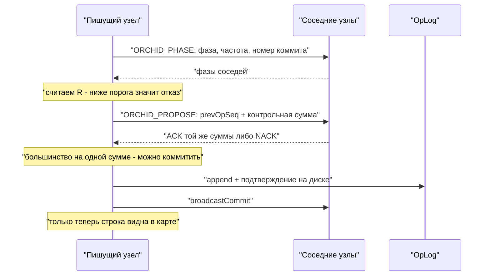

# Консенсус ORCHID

Три узла, одна база, клиент шлёт `UPSERT`. Нужно решить сразу две вещи: **разрешить запись только когда кластер согласован** и **не допустить, чтобы после обрыва связи в журналах оказались разные версии одних и тех же данных**.

В стеке вроде Raft узлы голосуют за лидера, пишет только он; лидер пропал — новые выборы. В Grid допуск записи устроен иначе. Лидер не выбирается голосованием. Узлы обмениваются **фазой** (модель связанных осцилляторов Курамото) и отдельно подтверждают каждую операцию **контрольной суммой** её содержимого (*digest*). Этот протокол называется **ORCHID**.

Восстановление после сбоя — снова свести фазы и набрать согласие по контрольной сумме, а не провести выборы.

## Словарь на одной таблице

| Понятие | Смысл |
|---------|-------|
| Параметр порядка `R` | Насколько фазы узлов близки. Запись разрешена при `R ≥ order-threshold` |
| Пишущий узел | Среди синхронизированных — узел с минимальным `nodeId`. Только он выдаёт следующий номер операции (*phase-ranked proposer*) |
| Согласие по контрольной сумме | Большинство из **конфигурации** подтверждает **одну и ту же** сумму, прежде чем коммит станет виден |
| `OrchidNotSyncedException` | Отказ в записи: либо `R` ниже порога, либо нет согласия по сумме |
| Одиночный режим | Узел пишет сам, только если список соседних узлов изначально пуст (`N = 1`) |

Значения по умолчанию: `coupling: 15.0`, `natural-freq-hz: 1.0`, `order-threshold: 0.85`, `tick-ms: 10`, `digest-quorum: MAJORITY`.

## Два вопроса

Их нельзя смешивать: ломаются и наблюдаются по-разному.

| | Синхронизация фаз | Подтверждение контрольной суммы |
|--|-------------------|--------------------------------|
| Вопрос | Кластер сейчас может предлагать запись? | Эта операция — та же, что видят остальные? |
| Область | Живые соседние узлы своего ЦОД | Узлы из конфигурации своего ЦОД плюс сам узел; при необходимости удалённые голосующие |
| Наблюдение | `orderParameterR`, кто пишущий | ACK / NACK на предложение, `pendingProposeAgeMs` |
| Отказ | `OrchidNotSyncedException` до предложения | Предложение не набрало большинства |
| Можно ли пропустить | Никогда | Никогда: фаза не заменяет сумму |

## Как проходит запись



*Схема 1. Сначала согласование и журнал, потом видимость строки. Лучше отказ клиенту, чем частично применённая запись.*

1. Узлы обмениваются `ORCHID_PHASE`: фаза, частота, номер последнего коммита, при необходимости сумма предложения.
2. По увиденным живым соседям считается `R`. Ниже порога — запись не принимается.
3. Пишущий узел шлёт `ORCHID_PROPOSE` с номером предыдущей операции. Конкурирующие предложения получают NACK.
4. Большинство подтверждений на одной контрольной сумме — операцию можно коммитить.
5. Запись дописывается в OpLog и подтверждается на диске (`confirmPersisted`) **до** рассылки коммита и до появления строки в карте.
6. Номер последнего подтверждённого коммита сохраняется в `orchid/state.bin`.

Узел с HELLO и тем же `clusterId` попадает в список соседей автоматически. YAML — начальный набор для знакомства, не жёсткое членство. Размер большинства по контрольной сумме считается по **настроенному** списку конфигурации, а не по тому, кто ответил в этот момент.

## Настройка осциллятора

Контур фазы должен сходиться заметно быстрее, чем фаза уходит вперёд за такт:

```
2 * pi * natural-freq-hz * tick-ms / 1000  ≪  1
```

По умолчанию `1 Гц` / `10 мс` / связность `15` сходятся. Поднять `natural-freq-hz` до `50` при том же такте — уже нет: за такт фаза уезжает слишком далеко, `R` падает ниже порога, и запись отклоняется на исправном кластере.

- Не трогайте значения по умолчанию без измеренной причины.
- Понижение `order-threshold` «чтобы не было отказов» прячет рассинхрон и ослабляет допуск записи.
- `tick-ms` — ещё и нижняя граница задержки решения о допуске: не поднимайте его ради снижения фонового CPU.

## Что нельзя ослаблять

### Приём записи

- При настроенных соседях запись требует `R ≥ order-threshold`.
- Одиночная запись — **только** если список соседей пуст с самого старта (`N = 1`).
- После разделения сети при `N ≥ 2` меньшая часть **не** объявляет себя синхронной только потому, что никого не видит. Пустой вид живых соседей права писать не даёт.
- По умолчанию `R` считается **внутри своего ЦОД**. Удалённые узлы в фазовый вид не входят. Связывание фаз через WAN выключено (`cross-dc.phase-coupling`) и не является основным путём согласованности.

### Согласие по контрольной сумме

- Голосуют **настроенные** узлы своего ЦОД плюс сам узел.
- Коммит требует большинства на **одной и той же** сумме для перехода `prevOpSeq → следующий`.
- `forgetPeer` чистит вид живых узлов, но **не уменьшает** размер большинства. Забыть соседа «чтобы облегчить кворум» нельзя.
- `SYNC_VOTERS_ACROSS_DC` добавляет подтверждения суммы с удалённых площадок (с таймаутом WAN), не втягивая их фазы в локальный `R`, пока связывание фаз выключено.

### Порядок операций

- Номер операции выдаёт только пишущий узел.
- `opSeq` глобальный; пропуски в потоке одного шарда нормальны.
- Структурный `UPDATE` становится `UPSERT`: пишущий сливает изменение через `LogicalFieldCursor` / `BlobFieldModifier`, в журнал уходит финальная строка.
- Линеаризуемое чтение (то, что смотрит Jepsen) — только с пишущего и только из уже зафиксированной карты.

### Запись на диск

- Append в OpLog и подтверждение — **раньше** рассылки коммита и раньше видимости в карте.
- Соседи при применении тоже пишут свой OpLog.
- Нет подтверждения — изменение не становится видимым: лучше отказ клиенту, чем два журнала.

Отрицательные свойства модели: `~MinorityWrite`, `~ForkedSlot`. Формальная модель: [orchid-tla](../internal/orchid-tla.md).

## Когда узлы теряют связь

| Ситуация | Поведение |
|----------|-----------|
| `N = 3`, один узел изолирован | Изолированный отказывает в записи; двое продолжают |
| `N = 3`, раздел 2 / 1 | Большинство по сумме набирает только сторона из двух |
| `N = 2`, раздел 1 / 1 | Не пишет никто — цена за отсутствие двух журналов |
| Связь восстановилась | Фазы снова сходятся, отставший подтягивает журнал; выборов нет |
| Рестарт после аварии | Читает `orchid/state.bin`, проигрывает хвост журнала |

Механизма «назначить себя пишущим, потому что остальные недоступны» нет. Смена роли для клиента — `ServerMeta` / `PROMOTE_NOTIFY` и `rediscoverWriter()`, не перебор хостов в URL: [повышение роли узла](../configure-and-operate/operations/ha-promote.md).

## Чего ORCHID не делает

Метрики `OrchidNode` (`orderParameterR`, `getPhaseRankedProposerId`, `pendingProposeAgeMs`) — только наблюдение. Они не заменяют согласие по сумме и не являются Raft-API лидера.

Где лежат шарды — отдельная задача: [размещение шардов](overlay-and-swarm.md). Границы метафор: [границы утверждений](bio-inspired.md).

Передача роли пишущего клиенту: [повышение роли узла](../configure-and-operate/operations/ha-promote.md).

## Что видит оператор

| Симптом | Куда смотреть |
|---------|----------------|
| `OrchidNotSyncedException` на записи | `R` ниже порога или нет большинства по сумме — [мониторинг](../configure-and-operate/monitoring.md) |
| `R` не устаканивается | Сверить `natural-freq-hz` с `tick-ms` |
| Растёт `pendingProposeAgeMs` | Предложения не набирают большинства: упал сосед, WAN-таймаут, сеть |
| Растут `orchidWaitP50/P99Ns` | Допуск и есть потолок записи — [ёмкость](../performance/capacity-slo.md) |
| Клиент на старом пишущем | Нет `PROMOTE_NOTIFY` или не вызван `rediscoverWriter()` |
| Одиночная запись после раздела сети | Запрещена: пустой список соседей только при старте с `N = 1` |

Дальше по теме: [сеть репликации](replication-network.md), [путь записи](write-path-staging.md), [настройка репликации](../configure-and-operate/configuration/replication.md), [несколько ЦОД](../configure-and-operate/operations/multi-dc.md).
