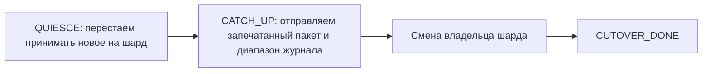

# Размещение шардов: закрепление и адаптивный перенос

Поверх карты размещения лежат две связанные вещи. **Закрепление (`PIN`)** — пометка «этот ключ пока не переносить». **Адаптивный перенос (*swarm*)** — подсказки и планы о том, когда владение шардом стоит отдать другому узлу. Вместе они держат размещение предсказуемым под нагрузкой. В конфигурации и метриках имена технические: `overlay`, `AdaptiveReplicaSwarm`, `apply-auto-cutover`.

Когда включена репликация, владение шардом не закреплено навсегда. `AdaptiveReplicaSwarm` смотрит на датчики узлов и может решить перенести шард. В среднем для кластера это полезно, но иногда перенос обходится дороже, чем экономит, — и тогда нужен способ сказать «этот ключ пока не двигай». Такой способ — `PIN`.

Сразу уберём частое недопонимание: `PIN` здесь **не имеет отношения** к закреплению буфера или плана запроса, как это называется в Oracle или SAP. Это про размещение шардов, а не про кэш и не про планы.

## Что делает swarm

`AdaptiveReplicaSwarm` собирает локальные датчики и превращает их в подсказки по размещению.

| Датчик | Что показывает |
|--------|----------------|
| `applyLag` | Отставание применения журнала на узле |
| `queueDepth` | Глубина очереди записи |
| `heapPressure` | Давление на память |
| `hitRate` | Доля попаданий в рабочий набор |
| `rttMs` | Сетевая задержка до пира |

Сводная оценка считается по окну `score-window-ms`, и при переходе порога `migrate-threshold` рождается подсказка `PlacementHint`.

| Подсказка | Смысл |
|-----------|-------|
| `KEEP` | Размещение в порядке, переносить не нужно |
| `SHED_LOAD` | Узел перегружен, работу лучше увести |
| `ATTRACT_LEARNER` | Подтянуть отстающий узел ближе к этим данным |
| `PREFER_DC` | Размещение стоит сместить в сторону конкретного дата-центра |

Подсказки влияют на срочность отправки изменений и на приоритет подтягивания, но **никогда не блокируют** подтягивание журнала при подключении узла. Подсказка `KEEP` не должна уметь отложить подтягивание навсегда — иначе эвристика размещения превратилась бы в проблему согласованности.

Если подсказка перерастает в решение о переносе, выполняется `ShardMigrator`.

## Как переносится владение шардом



*Схема 1. Перенос идёт через тот же журнал, что и обычная репликация.*

Правила безопасности переноса:

1. Смена владельца возможна только после того, как слив вошёл в фазу `CATCH_UP`.
2. Данные едут тем же надёжным путём: отправка журнала по Netty с подтверждением записи до видимости. Никакой «тихой» перезаписи карты нет. В фазе `CATCH_UP` дополнительно отправляются запечатанные артефакты шарда (`.gmap`, `.sbpt`, `.sbm`), если они привязаны.
3. Явно заданное размещение в `ShardPlacementMap` сильнее, чем разовый выбор целевого пира.
4. Пустой диапазон подтягивания переносу не мешает — он означает, что пир уже догнал. Непустой сначала отправляется сегментом с проверкой контрольной суммы.
5. Подключение узла и разреженное подтягивание всегда дотягивают хвост журнала.
6. Живой `PIN` на шарде отменяет перенос именно этого шарда. Открытая транзакция может подавить весь такт.

**Переключение владения (cutover)** — финальный шаг: после подтягивания журнала и запечатанного пакета шард меняет владельца (`CUTOVER_DONE`). Пока на ключе этого шарда жив `PIN`, шаг для него не выполняется.

### Автоматическое переключение владения

`grid.replication.swarm.apply-auto-cutover` по умолчанию равен `true`: план размещения действительно вызывает `ShardMigrator.migrateRange`. При `false` такт по-прежнему считает датчики и выдаёт подсказки, но перенос не выполняется.

Выключение — **временная** мера подавления под нагрузкой, а не постоянная настройка. Если оставить его выключенным, кластер продолжит считать планы, которые никогда не применяет, и размещение будет всё дальше от рекомендаций датчиков.

Что проверить на своей топологии после включения:

1. QUIESCE → CATCH_UP → смена владельца проходит без рассинхрона контрольных сумм OpLog, а владение переезжает только через отправку журнала.
2. Незавершённая транзакция удерживает `CATCH_UP` и не даёт владению «утечь».
3. `PIN` на ключе блокирует перенос **только своего** шарда, остальные продолжают переезжать.
4. Открытая SQL-транзакция может подавить весь такт, тогда как пометка остаётся в границах шарда.
5. Долговременная пометка переживает рестарт до `UNPIN` или истечения времени жизни.
6. Подсказки по набору голосующих не приводят к двум писателям вместе с закреплением клиента (`ServerMeta`, `PROMOTE_NOTIFY`).

### Подсказки по набору голосующих

```yaml
grid.replication.placement-optimizer:
  voter-set-hints-enabled: true
  target-remote-voters: 1
  apply-voter-set-hints: true   # по умолчанию включено; false = только подсказки и метрики
```

При `apply-voter-set-hints: true` такт swarm применяет рекомендацию через `OrchidNode.applyRemoteVoters` — **только удалённые голосующие по digest**. Локальный параметр порядка `R` при этом не меняется, поэтому на допуск локальной записи это не влияет. `PeerEndpoint` несёт роль `PeerRole` (`VOTER` или `LEARNER`), удалённые пиры помечаются из конфигурации нескольких ЦОД.

## Что делает PIN

`PIN` — пометка в `OverlayStore`: таблица плюс хеш ключа, при желании со временем жизни и меткой качества обслуживания.

| Делает | Не делает |
|--------|-----------|
| Ставит пометку «этот ключ сейчас лучше не переносить» | Не закрепляет строку в памяти навсегда |
| Пока пометка жива, такт swarm пропускает перенос | Не заменяет заданное размещение в `ShardPlacementMap` |
| При желании сохраняется на диск в каталоге `overlay/` | Не является вторым хранилищем строк |
| Виден в метрике `overlayPinnedKeys` | Не оптимизирует набор голосующих |

И чего `PIN` точно не касается:

- байты строки, журнал и ORCHID — это не изменение данных;
- план SQL-запроса;
- рабочий набор и запечатанные файлы — вытеснение и подгрузка идут как обычно;
- транзакции и блокировки записей — полностью ортогонально.

`UNPIN` снимает пометку. После снятия последней пометки или истечения её времени жизни перенос снова возможен.

### Три похожих по звучанию механизма

| Механизм | На какой вопрос отвечает | Срок жизни |
|----------|--------------------------|------------|
| `PIN` | Можно ли сейчас переносить шард этого ключа? | Время жизни или явный `UNPIN` |
| Размещение в `ShardPlacementMap` | Где этот шард должен жить по политике? | Конфигурация |
| `writerEligible` | Какой узел может принимать запись? | Состояние кластера в рамках эпохи |

Их путаница — самый частый источник недоразумений вокруг размещения.

## Когда это нужно

Четыре типовые ситуации, ради которых механизм и сделан:

**Крупный клиент на пике.** Один `tenant_id` даёт основную долю записи в шард. Swarm хочет его увести, и из-за подтягивания вырастет задержка в хвосте распределения именно у этого клиента. На время пика размещение замораживают, после пика снимают.

**Заморозка на время инцидента.** Узел ведёт себя нестабильно, с него снимают логи и метрики. Пока разбираются, гонять размещение не нужно.

**Длинная сессия.** Игровая или биллинговая сессия привязана к `session_id`, и перенос посреди сессии даёт лишние сетевые обращения. Пометка ставится при входе и снимается при выходе; время жизни выбирают как максимальный простой плюс запас, чтобы падение приложения не оставило пометку навсегда.

**Маленькая стабильная таблица настроек.** Обновляется редко, но соседние горячие ключи гоняют шард. Пометку ставят без времени жизни, до явного снятия.

Есть и автоматический вариант — короткая пометка после записи (`auto-pin-ttl-ms`). По умолчанию он выключен, и включать его на кластере с массовой загрузкой обычно не стоит: широкий набор записываемых ключей заморозит слишком много шардов.

Синтаксис, параметры и пошаговые сценарии: [overlay и PIN](../configure-and-operate/configuration/overlay-pin.md).

## Чего делать не надо

| Не надо | Почему |
|---------|--------|
| Считать `PIN` закреплением буфера или плана | Это про размещение шардов, совсем другой механизм |
| Ставить `PIN` на каждый ключ транзакции «на всякий случай» | Кластер перестанет балансироваться |
| Использовать `PIN` вместо надёжности и согласованности | За это отвечают ORCHID, журнал и транзакции |
| Оставлять вечные пометки без ревизии | Размещение застынет в неоптимальном состоянии |
| Включать большое автоматическое время жизни при массовой загрузке | Переносы будут подавлены постоянно |
| Ждать, что одна пометка остановит весь swarm | Блокируется только собственный шард ключа, остальные переезжают |

## Наблюдаемость

Что проверять после установки пометки:

1. Метрика `overlayPinnedKeys` выросла.
2. `isOverlayBlockingSwarmMigrate()` возвращает `true`.
3. В окне действия пометки нет применённых переносов.
4. Если сохранение на диск включено, пометка переживает рестарт узла.

Сторону swarm видно через датчик `swarm_hint` и детали проверки готовности. Метрики и дашборды: [мониторинг](../configure-and-operate/monitoring.md).

## Связанное

[сеть репликации](replication-network.md), [состояние репликации](replication-state.md), [границы утверждений](bio-inspired.md), [overlay и PIN](../configure-and-operate/configuration/overlay-pin.md), [настройка репликации](../configure-and-operate/configuration/replication.md).
